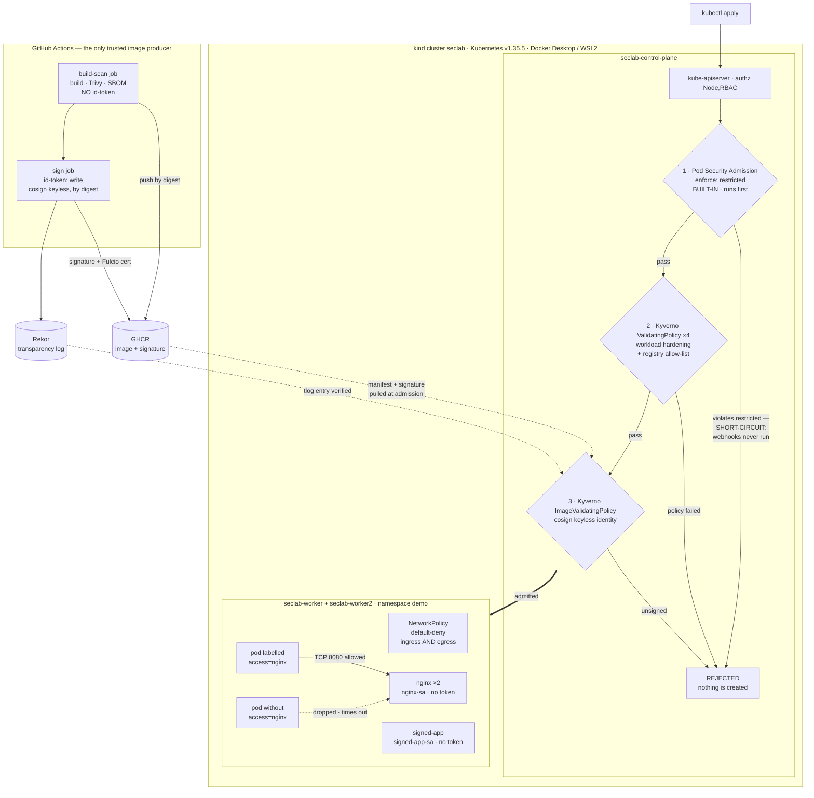

# k8s-security-lab

Hardened Kubernetes cluster + secure software supply chain, built to demonstrate "attack → control blocks it".

Every control in this repo ships with three things: an attack run against the live cluster, the verbatim transcript of that attack being refused, and a runbook that replays both. One layer answers after the fact instead of at the gate — phase 7's GitOps reconciliation reverts drift it has no way to refuse — and its transcript is of the attack being undone, with the time it ran first stated in the same breath. Phase 8 is a step further out again: its controller restored a deleted NetworkPolicy 19 ms after it started, but it ran as a process on the operator's host against the kubeconfig, and its in-cluster manifests are committed **unapplied** — so nothing on this cluster is running it, and no row below should be read as though something were. A control with no captured denial is listed as roadmap, not as a feature — and where a control's scope is narrower than its name suggests, the scope is written down rather than rounded up.

## Goal

Security is the point of this project, not DevOps. Kubernetes and CI are only the substrate; the real deliverable is a set of concrete, defensible security controls. Every layer of the stack gets a documented attack demo with before/after evidence, so the effect of each control is observable rather than assumed. The aim is to prove that a specific attack succeeds when a control is absent and is blocked once the control is in place. Treat this repo as a case study you can read top to bottom.

Read [`docs/threat-model.md`](docs/threat-model.md) first if you only read one file. It reframes the phases as adversary-driven design rather than a tool tour: named adversaries with goals and assumed starting capabilities, the five trust boundaries and what each guard does *not* cover, a MITRE ATT&CK mapping marked full vs partial, and a residual-risk section that states the gaps this lab deliberately leaves open.

## Architecture

A local kind cluster (1 control-plane + 2 workers) running on Docker Desktop with the WSL2 backend, defined entirely as code so the environment is reproducible. Kubernetes is pinned to v1.35.5 (node image pinned by digest) because the Kyverno 1.18 admission layer supports Kubernetes 1.33–1.35 only, so the cluster sits at the top of that supported window. Each security layer is added on top of this baseline cluster and exercised with its own attack demo.

The admission path — the ordered set of gates every workload passes before it exists, and where each attack dies:



Gate-by-gate notes, the sealed-secrets path (until 2026-08-07 the only other artifact that crossed from Git into the cluster; phase 7's ArgoCD `Application` is now a third path, and unlike the first two it writes continuously), and the full attack → control table are in [`docs/architecture.md`](docs/architecture.md).

## Security layers

### Built and proven

Run against the live cluster, each with a committed transcript. The first five **enforce**: they refuse the attack at admission, at the network layer, or by cryptography. The last six do something else, and the six are not the same thing. Phase 5 is an assessment: it runs on request, measures configuration once, and gates nothing. Phase 5b is a configuration change that does bind — a seccomp filter for pods that request none, a PID ceiling on every pod slice, an API server that verifies kubelet certificates — but no attack was run against it and nothing was refused, so what it carries is a before/after reading of the cluster rather than a rejection transcript. Phase 6 is a sensor: it watches continuously and writes an alert *after* the fact, which means the attack it reports on has already happened. Phase 6b is plumbing: it gives that alert a next hop, so it outlives the sensor pod that raised it and can be looked up afterwards — filing something that was already too late to prevent, which is not the same as answering it. Phase 7 is reconciliation, and it is the only one of the six that acts on an attack against this cluster rather than measuring, watching or filing it: it holds a committed desired state and puts the cluster back when the two diverge. But it is not in the request path and cannot refuse a write — every correction it makes happens after the API server accepted the change and after the kubelet started the resulting pod, so what it does is **correct**, never block. That puts it above the other four, which change nothing about an attack in progress, and below the five enforcing rows, which refuse it outright. **Phase 8 is the sixth, and it is not on that ladder at all.** It holds an invariant admission structurally cannot see, it detected the violation and it repaired it — and it **ran out of cluster**, as a process on the operator's host against the kubeconfig, with its in-cluster manifests committed unapplied, so on this cluster it enforces nothing, corrects nothing and watches nothing. What it establishes is that the invariant is checkable and that the check works against this cluster's real API; what it is not is a control operating here today. None of the six borrows the credibility of the five above it, and each says so in every column — the phase-6 and phase-6b rows in particular record "this was seen", never "this was stopped", the phase-7 row records "this was undone, and here is how long it ran first", never "this was blocked", and the phase-8 row records "a program that was not running in the cluster put this back", never "the cluster put this back". The scope column is there because these controls are namespace-scoped by design, not cluster-wide — see [§6.7 of the threat model](docs/threat-model.md#6-residual-risk-and-what-is-deliberately-out-of-scope); phase 5b is the one row whose scope is the whole cluster, because it changes the cluster's own configuration instead of adding a policy, and phase 7's scope column is the one that has to be read twice, because what it *reconciles* is 7 objects while what it *can reach* is everything — while phase 8's has to be read twice for the opposite reason, because what it *checks* is one namespace and what it *reaches on this cluster* is nothing at all.

| Layer | Tool | Attack it blocks | Enforced scope |
| --- | --- | --- | --- |
| RBAC hardening | Kubernetes RBAC | Privilege escalation via over-broad service account permissions | `developer` Role in `demo` (no `secrets`, no write verbs, no wildcards); `nginx-sa` / `signed-app-sa` mount no token at all |
| Admission control | Pod Security Admission + 4 Kyverno `ValidatingPolicy` in Deny | Deploying privileged / non-compliant workloads (privileged, `hostPath /`, capability add-back, `:latest`, unvetted registry) | PSA `enforce: restricted` on `demo`; the four Kyverno policies select `demo` + `demo-kyverno-only`, covering bare Pods, `pods/ephemeralcontainers`, `apps/v1` controllers and `batch/v1` jobs |
| Network policies | Kubernetes NetworkPolicy | Lateral movement between pods | Namespace `demo` — default-deny ingress **and** egress, a CoreDNS carve-out, and one label-gated allow pair on TCP 8080 |
| Secrets management | sealed-secrets | Plaintext secrets committed to Git | The committed ciphertext, bound by strict scope to `demo/demo-app-secret`; the private key never leaves `kube-system` |
| Supply chain | GitHub Actions + Trivy + cosign — builds are keyless-signed and, since 2026-07-29, a build's SBOM is `cosign attest`-ed to that same build's digest, both re-checked in CI by a post-publication self-check (attest path proven by one green run, 2026-07-29; the deployed digest predates it and stays unattested by design); admission is enforced by a Kyverno `ImageValidatingPolicy` that checks **signatures only** | Running an image this project never built — unsigned or untrusted-provenance images under the lab's own registry path | Images matching `ghcr.io/joesevv/k8s-security-lab/*` in `demo` + `demo-kyverno-only`. Docker Hub `nginxinc/*` and `curlimages/*` are out of glob on purpose: they have no signature to prove, and are constrained by the registry allow-list and digest pins instead |
| CIS benchmark **assessment, not a control** | kube-bench v0.15.6 (digest-pinned), run as two `batch/v1` Jobs with `--benchmark cis-1.12` | **None. This row blocks no attack and gates nothing** — it measures. kube-bench reads control-plane and node configuration and scores it against CIS; what it produced is a list of gaps, not a gate. The findings that were not already conceded elsewhere are written up in [§6.12 of the threat model](docs/threat-model.md#6-residual-risk-and-what-is-deliberately-out-of-scope). Running a benchmark measures a gap and does not close it; **what closed a subset of these is the separate configuration change in the row below**, on 2026-07-30 — seven of the eight checks it targeted flipped to PASS, taking the master target from 46 PASS / 10 FAIL / 50 WARN to **51 PASS / 6 FAIL / 49 WARN** and each worker from 17 / 2 / 6 to **19 / 2 / 4**. Most of §6.12 is still open: audit logging, encryption at rest, anonymous auth, the service-account token lifetime and the 644 file modes are all untouched | **Nothing is enforced by this row.** Its *scan* scope: namespace `cis-benchmark`, which carries no PSA enforcement label and sits outside the Kyverno policies' namespace selector — deliberately, because the scan requires `hostPID: true` and `hostPath` mounts of `/etc/kubernetes` and `/var/lib/etcd`, which `demo`'s `restricted` profile correctly refuses (that refusal is the phase's attack demo, below). Coverage was one control-plane Pod and one worker Pod, so **`seclab-worker2` was never scanned** — closed 2026-07-29: a DaemonSet re-run of the `node` target scanned both workers, so every worker now has a kube-bench report ([evidence §8](docs/evidence/phase-5-cis/attack-output.txt)). Coverage only; it still enforces nothing |
| CIS remediation + DR drill **a config change, not an attack demo** | `kubeadmConfigPatches` in [`clusters/kind-config.yaml`](clusters/kind-config.yaml) — `--profiling=false` on the API server, controller manager and scheduler; `--enable-admission-plugins=NodeRestriction,AlwaysPullImages` and `--kubelet-certificate-authority=/etc/kubernetes/pki/ca.crt` on the API server; `seccompDefault: true`, `podPidsLimit: 4096` and `serverTLSBootstrap: true` on every kubelet — applied the only way that tests whether the file is really the source of truth: `kind delete`, rebuild from the file, then bring six phases of controls back from git. That worked, but **not unattended**: four kubelet CSRs were approved by hand, the sealed secret had to be re-sealed from a gitignored plaintext that exists only on this host, and the config file itself needed correcting mid-drill before any cluster came up remediated | **Nothing was attacked here, so this row claims no denial.** What it has instead is ground truth measured either side of the rebuild on 2026-07-30: a pod that declares no `imagePullPolicy` is mutated `IfNotPresent` → `Always`, which is the AlwaysPullImages plugin acting rather than the flag merely being present; a pod that requests no `seccompProfile` goes from `Seccomp_filters: 1` to `2`, so the runtime default profile is now loaded for pods that ask for nothing; the pod cgroup slice caps at 4096 PIDs (the container scope still reads 18999, systemd's `DefaultTasksMax` — the limit binds one level up, and the probe that read the container scope was wrong, not the fix); and `kubectl logs` fails on every node with `remote error: tls: internal error` until each kubelet's serving CSR is approved, after which all three kubelets serve certificates issued by `CN=kubernetes` instead of the per-node self-signed CAs they used before. **Two things this row must not be read as saying.** The three `--profiling=false` flags were read off the process lines and scored by kube-bench; **no request was ever made to a profiling endpoint**, so "the endpoint is closed" is not claimed here. And check 4.2.9 **stayed WARN**, predicted in writing before the rebuild: the check reads `tlsCertFile` / `tlsPrivateKeyFile` out of the kubelet config file and `serverTLSBootstrap` writes neither, so the scanner number stood still while the trust root under it changed. The drill also re-proved the rows above on the rebuilt cluster — the nine phase-2b attack denials, the unsigned-image refusal, default-deny's timeout against a labelled pod's 200, a sealed-secret round trip matching the phase-3 digest, and both Falco markers, with RBAC re-checked as a `can-i` matrix rather than by replaying its attack — but that re-proves those rows, it is not an attack this row blocks | **Cluster-wide**, and the only row here that is: control-plane process flags and kubelet configuration on all three nodes, not a namespace selector. **What it did not fix is still not fixed** — audit logging (1.2.16–1.2.19), encryption at rest, anonymous auth (1.2.1), `--service-account-extend-token-expiration` (1.2.30), the 644 kubelet and CNI file modes, etcd data-directory ownership and the rest of [§6.12](docs/threat-model.md#6-residual-risk-and-what-is-deliberately-out-of-scope): as of 2026-07-30 the master target still scores 6 FAIL / 49 WARN and each worker 2 FAIL / 4 WARN. **No scanner-shaped exception was built either**, so kube-bench still runs in `cis-benchmark`, outside both enforcement layers. Evidence [`docs/evidence/phase-5b-cis-remediation/`](docs/evidence/phase-5b-cis-remediation/); runbook [`runbooks/phase-5b-cis-remediation.md`](runbooks/phase-5b-cis-remediation.md) |
| Runtime detection **alerts only, not a control** | Falco 0.44.1 (Helm chart `falco-9.1.0`; both images and both OCI artifacts digest-pinned), a 3-pod DaemonSet in namespace `falco` on the `modern_ebpf` driver, running the stock `falco-rules` ruleset pinned by digest — no custom rules were written | **None. This row blocks no attack and gates nothing** — it observes, and it observes late. Falco reads syscalls through an eBPF probe and prints a line to its own stdout when a rule matches; by then the thing it describes has already run. The demo is exactly that: an interactive shell spawned in the hardened `demo/nginx` pod returned exit 0, and a copy of busybox staged in `/dev/shm` executed with `evt_res=SUCCESS` — `readOnlyRootFilesystem` closed the image and left the one writable, executable path open. Falco emitted `A shell was spawned in a container with an attached terminal` at priority Notice and `File execution detected from /dev/shm` at priority Warning — the message text and the priority are what an alert line actually carries, since `json_output` is off and no line carries a rule name — and then nothing else happened: the pod is still `Running` with `restartCount` unchanged, nothing was killed, evicted or network-fenced. **Detection without response does not mitigate**, so this phase earns no ATT&CK mapping and its residual risk stays open — [§6.4 and §6.13 of the threat model](docs/threat-model.md#6-residual-risk-and-what-is-deliberately-out-of-scope) | **Nothing is enforced by this row.** Its *observation* scope: one pod per node on all three nodes, the `syscall` source only, the stock ruleset only. Three limits, all measured rather than assumed. **As phase 6 shipped it, the alert's entire lifetime was the falco container's stdout** — `file_output`, `http_output`, `program_output` and `json_output` were all off, and no falcosidekick, Talon or log store existed anywhere on the cluster, so an alert survived until log rotation or pod restart and reached no human. **Phase 6b changed the routing half of that on 2026-08-03 and only that half** (row below): `http_output` and `json_output` are on and the alert now reaches a store that outlives the sensor, while `responseActions.enabled` is still `false`, no output leaves the cluster and nothing puts an alert in front of a person — so this row still blocks nothing. **The three nodes are one shared WSL2 kernel**: a single event is reported by all three Falco pods at near-identical microseconds and only the pod co-located with the target resolves `k8s_pod_name`, so this is one kernel observed three times, not a three-node fleet, and any alert count must be divided by three. **False negatives were not enumerated** — the textbook `cat /etc/shadow` probe fires nothing at all here, because as uid 101 the open fails `EACCES` and the stock rule matches successful opens only. And the sensor itself runs `privileged: true` in namespace `falco`, which carries `pod-security.kubernetes.io/enforce: privileged` and sits outside the Kyverno namespace selector — a second unenforced namespace alongside `cis-benchmark` |
| Alert routing **plumbing, not a control** | falcosidekick 2.32.0, falcosidekick-ui 2.2.0 and `redis/redis-stack` 7.2.0-v11 — three images pinned by manifest-list digest across four chart value paths, since the UI's init container reuses the redis reference — enabled on the existing release with `falcosidekick.enabled=true` and `falcosidekick.webui.enabled=true`; chart `falco-9.1.0` upgraded in place to REVISION 2, Falco itself untouched at 0.44.1 on the same image digest and the same pinned ruleset | **None. This row blocks no attack and gates nothing** — it gives the alert a next hop. Falco's own config, read out of the running container rather than off the chart, moved `http_output.enabled` false → true, `http_output.url` from empty to `http://falco-falcosidekick:2801` and `json_output` false → true; the chart's own helper set all three and no `--set` flag named any of them. The demo is a shell spawned in the same hardened `demo/nginx` pod carrying the marker `P6B-ROUTED-MARKER`: **it succeeded, exactly as phase 6's did**, and was then read back out of the store by key, carrying `"rule":"Terminal shell in container"` and the ruleset's own ATT&CK tags (`T1059`, `mitre_execution`) — enrichment phase 6 could not capture, because `json_output` was off there. **It outlives the sensor:** all three Falco pods were deleted, `grep -c` on every replacement pod's log returned 0, and the same event under the same UUID was still retrievable. **The store is not durable, and that was tested rather than read off the spec:** `appendonly no`, `save 3600 1 300 100 60 10000`, `/data` empty with no `dump.rdb` on a Bound 1Gi `standard` PVC, and deleting the Redis pod took `DBSIZE` 4 → 0 — the only one of those thresholds this lab's alert volume can reach is `3600 1`, which comes due an hour after a change, so a snapshot trails the writes it protects by up to an hour and this six-minute-old store had taken none. Recovery was worse than the loss: ingest stayed broken afterwards, reported as `exceeding post rate limit`, an error naming the wrong cause — the UI builds its RediSearch index only at startup — until `kubectl rollout restart deployment/falco-falcosidekick-ui` was run by hand. **And nobody watches it:** falcosidekick's own startup line reads `Enabled Outputs: [WebUI]`, no external sink is configured, `responseActions.enabled` is still `false`, and there is no rota, no owner and no response action. **Routing an alert is not answering one**, so this phase earns no ATT&CK mapping either and [§6.4 and §6.13 of the threat model](docs/threat-model.md#6-residual-risk-and-what-is-deliberately-out-of-scope) stay open | **Nothing is enforced by this row.** Its *routing* scope, as of 2026-08-03: the three Falco pods POST to one in-cluster Service, the only sink is the Web UI, and that UI is reachable by `kubectl port-forward` alone — all three Services are ClusterIP, with no Ingress, no NodePort and no LoadBalancer. **What it leaves ungated is larger than what it routes.** Five more pods from three more images now run in namespace `falco`, which carries `pod-security.kubernetes.io/enforce: privileged` and sits outside the `[demo, demo-kyverno-only]` Kyverno namespace selector, so **nothing on this cluster compelled any of those digest pins** — the discipline is self-imposed and self-verified. The apiserver said so for free: the upgrade drew **four PSA `restricted` warnings**, so as rendered these pods would not pass `restricted`, though they fail on four categories (`allowPrivilegeEscalation`, capabilities, `runAsNonRoot`, `seccompProfile`) rather than the sensor's six, and every one is a field the chart already exposes — "could be gated and is not", not "cannot be gated". The store itself is a Redis with **no password and no NetworkPolicy**, so anything that can reach its Service port can read or delete the whole alert history. And the shared-kernel triplication is now visible in the router's own metrics: one attack moved `inputs_total` 1 → 4, counted per pod because the Service load-balances two falcosidekick replicas — divide by three, as before |
| GitOps drift control **corrects after the fact, not a gate** | ArgoCD v3.5.0 in namespace `argocd`, installed with `kubectl apply --server-side` from a version-pinned upstream raw URL whose sha256 is recorded rather than the floating `stable` tag; one `Application`, `demo-workloads`, at `targetRevision: main` with `prune: false`. Its own images are on upstream's tags, so the digests in the transcript are a record of what those tags meant on 2026-08-07, not a pin this repo enforces | **None. This row blocks no attack and gates nothing** — it is not in the request path, cannot refuse a write, and only ever puts a change back. The drift is a real regression applied to the **live** `demo/nginx` Deployment with `kubectl patch` — `readOnlyRootFilesystem: true` removed, the rest of the securityContext left intact — and `workloads/nginx/deployment.yaml` was never edited, which is what makes "ArgoCD restored it" mean anything. **The weakened pods were admitted:** the rollout completed with every event `Normal`, no PSA denial and no Kyverno denial, because `restricted` does not require that field and none of this repo's five Kyverno policies checks it. The weakening is real at the kernel rather than read off a spec — the container's root mount went `overlay / overlay ro` → `overlay / overlay rw`, and `touch /var/cache/nginx/p7-probe` went from `Read-only file system` (exit code: 1 — EROFS) to (exit code: 0). **Stage 1, `selfHeal: false` — detection without correction.** ArgoCD flipped to `OutOfSync / Healthy`, correctly naming `Deployment/nginx` as 1 of the 7, and then did nothing about it: 17 consecutive samples from 18:07:15Z to 18:15:19Z all show the field still absent, two probe files were written ten minutes apart into a root filesystem git says is read-only, and the drift stood for **10 min 8 s (608 s)** — ended by a human flipping a flag, not by ArgoCD. **Stage 2, `selfHeal: true` — correction.** The standing drift was reverted by the controller itself (`initiatedBy: {"automated":true}`, `startedAt` == `finishedAt`) before the first 2 s poll could catch it in progress, so **no latency figure is claimed for that one** — it is below the sampling resolution. The same drift re-run came back in **1.29 s**, and that is an upper bound at 1 s poll resolution, not an instrumented latency. **The window shrinks and never closes.** A pod from the drifted ReplicaSet was created, its image pulled, and its container started at 18:17:41Z and killed at 18:17:42Z — a container with a writable root filesystem really ran on a worker node, for roughly **1 s** (event timestamps have 1 s resolution, so the bound is about 0–2 s). 608 s to about one second is the entire result of this phase: admission control is the only layer that can make that number zero, and admission control is the layer that does not look at this field | **Nothing is enforced by this row.** Its *reconciliation* scope, as of 2026-08-07: exactly **7 objects** from `workloads/` and nothing else — Namespace `demo`, ServiceAccounts `nginx-sa` and `signed-app-sa`, Deployments `nginx` and `signed-app`, Services `nginx` and `signed-app` — at `targetRevision: main`, `prune: false`. Everything else in the same namespace is outside it and has no drift control at all: with `selfHeal` **on**, a label injected onto the `developer` Role survived **4 min 57 s (297 s)** across 15 consecutive samples while the Application never left `Synced`, and it was removed by hand because ArgoCD was never going to. **What ArgoCD itself can reach is the opposite of narrow, and that is this row's real cost.** The `argocd-application-controller` ClusterRole is `apiGroups ['*'] resources ['*'] verbs ['*']` plus `nonResourceURLs ['*'] verbs ['*']` — diffed against the built-in `cluster-admin` rather than eyeballed, and **byte-identical** (exit code: 0 — no difference) — so it can read every Secret in every namespace, including the sealed-secrets private key; `argocd-server`, the component behind the UI, separately holds `delete,get,patch` on `*/*` cluster-wide. **And nothing gates any of it:** namespace `argocd` carries no Pod Security label at all, so the built-in `privileged` default applies (the apiserver has no `--admission-control-config-file`), and it sits outside the `[demo, demo-kyverno-only]` selector all five Kyverno policies use — the **third** unenforced namespace after `cis-benchmark` and `falco` ([§6.7 and §6.14](docs/threat-model.md#6-residual-risk-and-what-is-deliberately-out-of-scope)) — so every pin applied to ArgoCD's own images here is self-imposed and unenforced. Nothing verifies the content it syncs either: no `signatureKeys` on the AppProject and no keys in `argocd-gpg-keys-cm`, so any commit that reaches `main` is applied faithfully, and with `selfHeal: true` re-applied every time a human removes it by hand. Reachable by `kubectl port-forward` only — ClusterIP, no Ingress — and the initial admin credential was never retrieved, so the UI was never opened. Evidence [`docs/evidence/phase-7-argocd/`](docs/evidence/phase-7-argocd/); install record [`clusters/argocd-install.md`](clusters/argocd-install.md); runbook [`runbooks/phase-7-argocd.md`](runbooks/phase-7-argocd.md) |
| Custom controller **checks an invariant admission cannot see — and is not deployed** | [`app/netpol-guard`](app/netpol-guard/), a single-binary Go controller (Go 1.26.5, `k8s.io/client-go` v0.35.5 — the exact patch match for the cluster's v1.35.5 server), two-stage `Dockerfile` onto `distroless/static-debian12:nonroot` with both bases pinned by `tag@sha256`, running as a non-root uid and **detect-only by default**, so turning on remediation has to be a deliberate act in a manifest. It polls one namespace on a timer and holds one invariant: **every pod in `demo` must be selected by a NetworkPolicy for both `Ingress` and `Egress`**, computed through `metav1.LabelSelectorAsSelector` so that an empty `podSelector` means *every pod* rather than *no pod*. `go build`, `go vet` and `go test` each exit 0 — 4 tests, 17 subtests, one of which encodes this phase's live scenario as a fixture | **None. This row blocks no attack and gates nothing** — and alone among the six, it is not even running here. What it demonstrates is the shape of a hole in the gate: the violation is caused by **deleting** an unrelated object, so no pod is the subject of any request at the moment its protection disappears and there is no AdmissionReview to refuse. That is structural rather than a configuration gap, and it was read off the policies rather than argued — all five Kyverno policies' `matchConstraints` were printed and `networkpolicies` appears **zero** times, `DELETE` **zero** times; fixing both would still not be enough, because admission sees one object per request while this invariant is a property of the whole *set* of pods and policies in the namespace. The demo is `kubectl delete networkpolicy default-deny -n demo`, an ordinary command nothing objected to, and its blast radius was computed off the live policy set beforehand: `allow-dns` has an empty `podSelector` with `Egress` so every pod stays egress-isolated regardless, and `allow-nginx-ingress-from-client` keeps `nginx` ingress-isolated, so the delete strips ingress isolation from **`signed-app` alone** — one pod, one direction. **The regression is real at the TCP layer, and it has two controls.** From a kind node that is *not* the pod's own, curl to `signed-app` went `HTTP:000 time=5.002004` (exit code: 28 — the DROP turned into a 5 s timeout) → `HTTP:200 time=0.001430` (exit code: 0) **226 ms** after the delete → `HTTP:000` (exit code: 28) again after remediation. nginx from that same source stayed blocked throughout, which is the differential control, and the pod's own node kept answering `HTTP:200`, which is the liveness control — kindnet does not police same-node host→pod traffic, and that is why a remote node was required. **Detect-only: the violation stood across 7 consecutive scans and nothing else on this cluster noticed** — `kubectl get events -n demo` returned `No resources found in demo namespace`, no PSA warning and no Kyverno denial, and ArgoCD sat `Synced / Healthy` the whole time, correctly, because it manages `workloads/` and not `network/`. **Remediate:** `default-deny` recreated with a spec **byte-identical** to [`network/00-default-deny.yaml`](network/00-default-deny.yaml) — both printed through the same kubectl jsonpath printer and compared, `cmp` (exit code: 0 — no difference) — under field manager `netpol-guard`, exactly one create, and no churn across the six `HOLDS` scans that followed. Detection latency **6.950 s** at `--interval=15s`; **19 ms** from process start to create. **The 174.670 s total in the transcript is the shape of the demo, not a latency:** 96.950 s of it is stage 1 deliberately doing nothing and about 68 s is a human gap between stopping one process and starting the next, so it measures this demo's exposure and nothing the code does | **Nothing is enforced by this row, and nothing is running.** Its *check* scope, as of 2026-08-07 and only while a human runs it: one namespace per process (`demo` by default), NetworkPolicies against Pods and nothing else — not Services, not Ingress objects, not CNI enforcement, not other namespaces — with terminal pods skipped by a filter no unit test covers. **It ran out of cluster.** Every observation above comes from a host process against `C:/Users/josep/.kube/config` using the operator's own credentials, not a ServiceAccount token; the `Deployment`, `ServiceAccount`, `Role` and `RoleBinding` committed under [`docs/evidence/phase-8-netpol-guard/`](docs/evidence/phase-8-netpol-guard/) are **UNAPPLIED**, validated client-side by dry run only, and `kubectl -n demo get deployment netpol-guard` answers `Error from server (NotFound)` (exit code: 1 — it does not exist). **It checks that isolation exists, not that the rules are sensible:** a policy that selects every pod for both directions and then allows everything from everywhere satisfies this invariant completely and every scan would print `verdict=HOLDS` — phase 2c is the row that argues `demo` is segmented, and this one only keeps that argument's foundation from vanishing unnoticed. It reconciles on a timer, so the unprotected window is measured rather than theoretical: 6.950 s at the interval used, about 30 s at the shipped `30s` default, and unbounded if the single replica is wedged — one replica, no leader election, never tested with two. The unit tests cover the pure isolation model only, **not** the client-go call path, the scan loop, `restoreBaseline` against any apiserver real or fake, error and retry behaviour, or RBAC-denied responses; everything cluster-facing was proven by running it rather than by a test. **Why it is not in the cluster is a finding about this lab rather than an apology:** phase 5b's own `AlwaysPullImages` forces the kubelet to pull, so `kind load` side-loading no longer works; CI builds exactly one context, `app/signed-app`, and publishes only on `push` to `main`; and `require-keyless-signed-ghcr` would then have to admit the image in `demo`, which needs a cosign signature from the pinned workflow identity. A CI change, a merge and a signature — three human gates, and the lab's own hardening is what closed the shortcut past them. **That third gate is reasoned from the policy's `matchConstraints` and scope, not observed** — a server-side dry run was deliberately not run. A fourth gate turned up while writing the manifest: a pod in `demo` could not reach the apiserver at all, because `default-deny` isolates egress and the only carve-out is DNS, while the `kubernetes` endpoint is the host-network address `172.18.0.2:6443` that no `podSelector` can select; an `ipBlock` exception was deliberately **not** added, because widening `network/` to host the watchdog would weaken the thing being watched. **The RBAC is the contrast worth keeping.** The committed `Role` grants `list` on pods and `get,list,create` on networkpolicies in one namespace — no `update`, no `patch`, no `delete`, nothing cluster-scoped, no secrets, and no `watch`, because the controller polls — so "it will never modify or delete a policy it did not create" is enforced by the apiserver rather than by the code's intentions. Phase 7's `argocd-application-controller` ClusterRole, in this same cluster, is byte-identical to `cluster-admin`. Both are "a controller that fixes drift". Evidence [`docs/evidence/phase-8-netpol-guard/`](docs/evidence/phase-8-netpol-guard/) (attack-output.txt, deployment.yaml, rbac.yaml); runbook [`runbooks/phase-8-netpol-guard.md`](runbooks/phase-8-netpol-guard.md) |

Two limits of the supply-chain row worth stating on the front page rather than in a footnote. The CVE gate is **report-only**: Trivy runs with `exit-code: '0'`, so `CRITICAL`/`HIGH` findings are uploaded as SARIF and never fail the build. And a signature attests **provenance, not the absence of vulnerabilities** — a signed image carrying a critical CVE is admitted by design. Both are deliberate, and both are written up with the rest of what this lab does not defend in [§6 of the threat model](docs/threat-model.md#6-residual-risk-and-what-is-deliberately-out-of-scope).

The phase-5 row's numbers need the same care, because "CIS benchmark" reads as a compliance score and this is a scan of a kind cluster. The two Jobs of 2026-07-26 — the master Job plus one node Job — scored **63 PASS / 12 FAIL / 56 WARN**, and not one of those three numbers means what it appears to mean. **63 is "checks kube-bench scored as passing", not "controls verified compliant"** — check 4.2.5 is a demonstrated false PASS, scored `noteq 0` against the *string* `0s`, and `0s` really is what `/var/lib/kubelet/config.yaml` contains on all three nodes, the exact condition that check exists to forbid. That mis-scoring is a fact about the scanner and it stands; what the *running* kubelet does with that file value is a separate question, and phase 5b found the two disagree — `/configz` reports `streamingConnectionIdleTimeout` as `4h0m0s` on all three nodes, on the old cluster and again on the rebuilt one, and that reconciliation is open ([§6.12 item 5](docs/threat-model.md#6-residual-risk-and-what-is-deliberately-out-of-scope)). **38 of the 56 WARNs were never evaluated at all**: 27 are `type: manual` checks that carry no audit command and print WARN unconditionally, and 11 shell out to `kubectl` from a Pod that deliberately mounts no ServiceAccount token, so their audits return nothing. That leaves **30 checks (12 FAIL + 18 WARN) that actually ran and did not pass**. Reading the rest as failures would state the opposite of reality — 5.2.1, 5.2.3 and 5.2.11 all WARN, while this cluster demonstrably denies exactly what they ask about. And a good CIS score on kind is mostly kubeadm's defaults rather than a hardening decision this lab made ([§6.8](docs/threat-model.md#6-residual-risk-and-what-is-deliberately-out-of-scope)) — with the narrow exception, since 2026-07-30, of the eight settings phase 5b wrote into `clusters/kind-config.yaml`. Full triage in the runbook. **Those figures are the 2026-07-26 reading and are no longer current:** on the cluster rebuilt from that file the master target scores 51 PASS / 6 FAIL / 49 WARN / 0 INFO and each worker 19 PASS / 2 FAIL / 4 WARN / 0 INFO (2026-07-30).

### Roadmap

Empty as of 2026-08-07. The one item left — a custom controller in Go, carried as a stretch goal — landed as phase 8 in the table above, and nothing was invented to take its place. What remains is not a planned layer, and calling it one would be padding: it is two open threads, each recorded where the work is. **Deploying phase 8's controller into the cluster**, which needs a second CI build/push job, a merge to `main` and a cosign signature — three human gates, and phase 5b's own `AlwaysPullImages` closed the `kind load` shortcut that would have avoided all three ([runbook §7](runbooks/phase-8-netpol-guard.md)). And **the 18 m 32 s that run `30480411426`'s `Verify attestation` step spent** between cosign's first output line and the next step in the job — the log narrows where the time went and states no cause, and none is asserted ([evidence](docs/evidence/phase-4-supply-chain/attack-output.txt)). Everything else this lab does not do is conceded rather than scheduled — [§6 of the threat model](docs/threat-model.md#6-residual-risk-and-what-is-deliberately-out-of-scope).

## Attack → control mapping

One entry per demonstrated attack, each pairing the attack with the control that answers it and linking to the captured evidence. The first six rows pair an attack with the control that **blocks** it. The last three do not, and they do not fall short in the same way, so none is allowed to read as though it did: in phase 6 the attack **succeeds** and is merely reported; in phase 7 it succeeds, runs, and is then **undone** — an answer that arrives after the fact rather than one that refuses; and in phase 8 it succeeds, runs, and is **repaired by a program that was not running in the cluster**. **"Refused" is the stronger word and phase 7 does not earn it:** the drift is admitted, the replacement pod starts, and reversion is not refusal. The row is here because the cluster's answer to that attack is a distinct, measured act against it — the state really is put back, in 1.29 s at the outside, and the transcript times how long the weakened container ran first — not because anything stopped it. So this table's contract is an attack run against the live cluster plus the verbatim transcript of what the cluster did about it, named exactly: refused, reported, or reverted. **Phase 8 stretches that contract, and the stretch is named here rather than buried in the row.** Its attack was run against the live cluster and its transcript is verbatim, but what answered was a Go binary on the operator's host carrying the operator's credentials — not anything this cluster runs, then or now. So it takes a fourth verb, **repaired, and not by the cluster**, and the row says so in its first sentence and twice more after that. It is here rather than left out because the attack is one no other row covers, and because what the cluster itself did about it is the most useful negative result in this table: nothing at all — no event, no admission decision, and ArgoCD green throughout. **Phase 6b still takes no row here at all** and the count is now nine: it ran phase 6's attack to phase 6's outcome and changed only where the resulting alert is filed, so it has no answer of its own to record. Its evidence is linked from the layers table above instead.

| Control | Attack | Evidence |
| --- | --- | --- |
| Phase 2a RBAC — least-privilege `developer` Role (get/list/watch pods/services/deployments only) + no-token `nginx-sa` | Token-bearing pod (`developer-sa`) uses its mounted ServiceAccount token to read Secrets via the API | HTTP 403 Forbidden — [`docs/evidence/phase-2a-rbac/`](docs/evidence/phase-2a-rbac/) (attack-output.txt, can-i-matrix.txt); runbook [`runbooks/phase-2a-rbac.md`](runbooks/phase-2a-rbac.md). Layered defense: the secret-read path is now blocked by **both** RBAC (403) and Phase 2c NetworkPolicy egress default-deny — a replay today times out at the network layer before RBAC's 403, so see [`REPLAY-NOTE.md`](docs/evidence/phase-2a-rbac/REPLAY-NOTE.md) for the replay caveat |
| Phase 2b admission — 4 Kyverno CEL `ValidatingPolicy` rules in Enforce (no privileged, no `:latest`/bare tags, must drop ALL caps and add none back, registry allow-list) scoped to `demo` + `demo-kyverno-only`, plus PSA `enforce: restricted` on `demo` | Nine attack applies: the four single-rule pods, capability add-back, a privileged Deployment and a privileged CronJob (the pod-controller path), an ephemeral-container injection via `kubectl debug`, and a `hostPath /` + `runAsUser: 0` pod | All denied at admission, each rejection naming the policy — or, for `hostPath`/`runAsUser`, naming PodSecurity, since **no Kyverno policy here covers `hostPath`** and PSA is what closes that gap; compliant workloads still admit — [`docs/evidence/phase-2b-admission/`](docs/evidence/phase-2b-admission/) (attack-output.txt, attack-*.yaml); runbook [`runbooks/phase-2b-admission.md`](runbooks/phase-2b-admission.md) |
| Phase 2c network — default-deny ingress+egress NetworkPolicies in `demo` with a CoreDNS carve-out (53/UDP+TCP) and a label-based allow pair (nginx ingress from `access=nginx` pods on TCP 8080, matching client egress) | Unauthorized pod (no `access=nginx` label, otherwise identical to the authorized client) curls `nginx.demo.svc.cluster.local` | Connection blocked by NetworkPolicy — HTTP:000 after a 5s timeout, while the labeled control pod gets HTTP:200 in milliseconds and both pods still resolve DNS — [`docs/evidence/phase-2c-network/`](docs/evidence/phase-2c-network/) (attack-output.txt, attacker-unauthorized.yaml, client-authorized.yaml); runbook [`runbooks/phase-2c-network.md`](runbooks/phase-2c-network.md) |
| Phase 3 secrets — sealed-secrets controller (v0.38.4, kube-system), strict-scoped SealedSecret committed to Git | Repo reader takes the committed SealedSecret and tries to recover the plaintext (base64-decode the ciphertext / reseal into an attacker namespace) | Ciphertext decodes to garbage, offline unseal impossible without the in-cluster private key, scope-theft rejected, in-cluster round-trip confirmed by SHA-256 match, and `git grep` finds no plaintext — [`docs/evidence/phase-3-secrets/`](docs/evidence/phase-3-secrets/) (attack-output.txt, scope-theft-attacker-ns.yaml); runbook [`runbooks/phase-3-secrets.md`](runbooks/phase-3-secrets.md) |
| Phase 4 supply chain — Kyverno `ImageValidatingPolicy` `require-keyless-signed-ghcr` (Deny + `failurePolicy: Fail`) requiring a cosign keyless signature whose Fulcio identity equals one exact workflow subject, checked against the Rekor log; matched on `ghcr.io/joesevv/k8s-security-lab/*` in `demo` + `demo-kyverno-only` | An image that **really exists in the registry and really has no signature** — cosign's own signature artifact, published under the OCI referrers-fallback tag `sha256-<digest>`, which nothing ever signed itself — deployed as a bare Pod and again as a Deployment, both otherwise fully compliant with every other control | Denied at admission with the policy's own verdict (`Policy require-keyless-signed-ghcr failed: Image must be cosign keyless-signed by the k8s-security-lab GitHub Actions workflow`), on the Pod path and the `apps/v1` path; the genuinely signed digest still admits as the positive control, and the out-of-glob nginx workload is unaffected — [`docs/evidence/phase-4-supply-chain/`](docs/evidence/phase-4-supply-chain/) (attack-output.txt, attack-unsigned-existing-artifact.yaml, attack-unsigned-image.yaml); runbook [`runbooks/phase-4-supply-chain.md`](runbooks/phase-4-supply-chain.md). A second case using a tag CI never built is kept separate on purpose: a registry 404 proves only that the gate fails closed, not that signatures are checked |
| Phase 5 CIS assessment — no new control; this row re-tests PSA `enforce: restricted` on `demo` and the Kyverno `ValidatingPolicy` set from the opposite direction, with the lab's **own security scanner** as the object being refused | kube-bench genuinely requires `hostPID: true` and `hostPath` mounts of `/etc/kubernetes`, `/var/lib/etcd` and `/var/lib/kubelet` to read what CIS asks about. That spec is applied to `demo` twice — once as a bare Pod, once as the `batch/v1` Job it really ships as — to see whether a *legitimate* privileged workload is treated any differently from an attacker's | Refused both times, **by two different controls at two different stages, and the difference is the point**. Pod path: `Error from server (Forbidden): ... violates PodSecurity "restricted:v1.35": host namespaces (hostPID=true), restricted volume types ..., runAsNonRoot != true, runAsUser=0` — four independent violations, PodSecurity naming the *pinned* `v1.35` enforce version. Job path: PodSecurity only **warns** (`restricted:latest`) and would have admitted, because PSA enforces against Pods, not against `batch/v1` controllers; the denial instead comes from Kyverno `restrict-registries` — **for the registry, not for `hostPID` or `hostPath`**, since no `ValidatingPolicy` here covers either. Claiming "Kyverno blocks kube-bench because it is privileged" would exceed enforced reality. The scan therefore ran in `cis-benchmark`, outside both layers, which is [§6.7](docs/threat-model.md#6-residual-risk-and-what-is-deliberately-out-of-scope)'s conceded residual risk made explicit rather than hidden in `default` — [`docs/evidence/phase-5-cis/`](docs/evidence/phase-5-cis/) (attack-output.txt, rejected-in-demo-pod.yaml, rejected-in-demo-job.yaml, job-kube-bench-master.yaml, job-kube-bench-node.yaml); runbook [`runbooks/phase-5-cis-benchmark.md`](runbooks/phase-5-cis-benchmark.md). What this does **not** show: that kube-bench is malicious, or that the refusal is desirable — a real remediation would need a scanner-shaped exception, and this lab did not build one |
| Phase 6 runtime detection — **no new control, and the first of the two rows here whose attack is not blocked**. Falco 0.44.1 runs as a DaemonSet in its own `falco` namespace and reports on behaviour that PSA, Kyverno and NetworkPolicy already admitted. Two demonstrations sit in this row: what the sensor sees, and what this cluster does when the sensor itself asks to run in `demo` | An interactive shell — a real PTY, obtained with `script` on the node, not a synthesized event — spawned inside `demo/nginx-775678cbbd-q7ddt`, which is the hardened workload: uid 101, capabilities dropped, read-only rootfs, digest-pinned signed base image. Then a copy of busybox staged into `/dev/shm` and executed, `/dev/shm` being the one writable and executable path `readOnlyRootFilesystem` leaves open | **Both attacks succeeded. Neither was blocked, and that is the finding.** The shell returned exit 0 and printed its marker; the staged binary ran with `evt_res=SUCCESS proc_exepath=/dev/shm/bb`. Falco's entire response was alert lines on a pod's stdout — three of them in the attack window, since an earlier, unrecorded shell-spawn rehearsal at `15:12:42.954798594` sits in the same log ahead of the two demonstrations. The two that answer the attacks above, each timestamped inside the window: `15:13:32.047577782: Notice A shell was spawned in a container with an attached terminal \| ... user_uid=101 process=sh proc_exepath=/bin/busybox ... terminal=34816 container_name=nginx k8s_pod_name=nginx-775678cbbd-q7ddt k8s_ns_name=demo` and `15:14:27.005294126: Warning File execution detected from /dev/shm \| evt_res=SUCCESS ... proc_exepath=/dev/shm/bb`. Afterwards the target pod is still `Running` on the same node with `restartCount` unchanged at 2 (last restart 26h earlier) and `/dev/shm/bb` still present and executable — nothing killed, evicted or fenced it. The second demonstration is the placement constraint, and it splits by object form exactly as phase 5's did: the Falco Pod spec applied to `demo` is refused by PodSecurity — `Error from server (Forbidden): pods "falco-psa-isolated" is forbidden: violates PodSecurity "restricted:v1.35": privileged ..., restricted volume types ..., runAsNonRoot != true ...` — while the DaemonSet form draws only a PSA **warning** naming `restricted:latest` and is denied by Kyverno instead (`admission webhook "vpol.validate.kyverno.svc-fail" denied the request: Policy require-drop-all-capabilities failed ...; Policy restrict-registries failed ...; Policy disallow-privileged-containers failed ...`). A first Pod probe is kept in the evidence precisely because it answered the wrong question: it was refused by the **ServiceAccount admission plugin** (`error looking up service account demo/falco: serviceaccount "falco" not found`) in the mutating phase, before PSA ever evaluated it, so reading "PSA refuses Falco" off that output would have been false — [`docs/evidence/phase-6-falco/`](docs/evidence/phase-6-falco/) (attack-output.txt, 00-namespace-falco.yaml, falco-daemonset-rendered.yaml, rejected-in-demo-daemonset.yaml, rejected-in-demo-pod.yaml, rejected-in-demo-pod-sa-isolated.yaml); install record [`clusters/falco-install.md`](clusters/falco-install.md); runbook [`runbooks/phase-6-falco.md`](runbooks/phase-6-falco.md). What this does **not** show: that either attack was prevented; that anyone would have found out — on 2026-07-29 the alert went to a container's stdout with no routing and no persistence, and since 2026-08-03 phase 6b has routed alerts to a store that outlives the sensor pod, but there is still no notification, no on-call and no response action, so the alert is now retained for whoever goes looking rather than delivered to anyone; or that comparable behaviour is caught in general — the textbook `cat /etc/shadow` probe against this same pod produced **no alert at all**, because the open failed with `EACCES` and the stock rule matches successful opens only |
| Phase 7 GitOps drift control — **the second row whose attack is not blocked, and the only one whose attack is undone.** ArgoCD v3.5.0 in namespace `argocd`, one `Application` `demo-workloads` syncing the repo's `workloads/` path — 7 objects — into `demo` at `targetRevision: main`, `prune: false`. It is not an admission plugin and is not in the request path: it **corrects**, and only after the API server has accepted the change and the kubelet has started the pod | A human "just fixing it in prod": `kubectl patch` removes `readOnlyRootFilesystem: true` from the **live** `demo/nginx` Deployment, leaving the rest of the securityContext intact so this is a realistic regression rather than a demolition. `workloads/nginx/deployment.yaml` is never edited — `git diff --stat HEAD -- workloads/` is empty and `git status --short -- workloads/` is clean — so the desired state being restored to was not quietly moved to match. The field was chosen **because the admission layer permits it**: PSA `restricted` does not require it and none of the five Kyverno policies checks it. The same drift is run twice, one boolean apart — once with `selfHeal: false`, once with `selfHeal: true` | **Admitted both times; reverted only the second time.** The replacement pods rolled out with every event `Normal` — no PSA denial, no Kyverno denial — and the weakening is real at the kernel, not in the spec: `overlay / overlay ro` → `overlay / overlay rw`, and `touch /var/cache/nginx/p7-probe` moved from `Read-only file system` (exit code: 1 — EROFS) to (exit code: 0). With `selfHeal: false`, ArgoCD went `OutOfSync / Healthy` naming `Deployment/nginx` and left it there: 17 consecutive samples from 18:07:15Z to 18:15:19Z with the field still absent, two probe files ten minutes apart inside a root filesystem git says is read-only, **10 min 8 s (608 s)** in all, ended by an operator flipping a flag. With `selfHeal: true`, the sync is the controller's own — `initiatedBy: {"automated":true}` — the standing 10-minute drift was gone before the first 2 s poll, below the sampling resolution and therefore quoted as no figure at all, and the same drift re-run was reverted in **1.29 s** (an upper bound at 1 s poll resolution). **And it still ran:** pod `nginx-6758c84c75-t6v8w` from the drifted ReplicaSet was created, its image pulled, its container started at 18:17:41Z and killed at 18:17:42Z — roughly **1 s** of writable root filesystem on a worker node, bounded at about 0–2 s by the 1 s event resolution — [`docs/evidence/phase-7-argocd/`](docs/evidence/phase-7-argocd/) (attack-output.txt); Application manifest [`gitops/application-workloads.yaml`](gitops/application-workloads.yaml); install record [`clusters/argocd-install.md`](clusters/argocd-install.md); runbook [`runbooks/phase-7-argocd.md`](runbooks/phase-7-argocd.md). What this does **not** show: that the attack was prevented — it was admitted, it ran, and 608 s → about 1 s is a smaller window and not a closed one; that anything outside `workloads/` is covered — a label injected onto the `demo/developer` Role survived **4 min 57 s** with `selfHeal` on while the Application never left `Synced`, and a human removed it; or that the source of truth is trusted — no commit signature verification is configured, so a malicious commit on `main` would be applied faithfully and, with `selfHeal: true`, re-applied every time someone removed it by hand |
| Phase 8 netpol-guard — **the third row whose attack is not blocked, and the only one whose answer did not come from the cluster.** A Go controller ([`app/netpol-guard`](app/netpol-guard/), `k8s.io/client-go` v0.35.5 against the cluster's v1.35.5) holding one invariant in `demo` — every pod selected by a NetworkPolicy for both `Ingress` and `Egress` — polled on a timer and detect-only unless `--remediate` is passed. **It ran out of cluster:** a process on the operator's Windows host against `C:/Users/josep/.kube/config`, carrying the operator's own credentials rather than a ServiceAccount token. The in-cluster `Deployment`, `ServiceAccount`, `Role` and `RoleBinding` are committed **UNAPPLIED**, and `kubectl -n demo get deployment netpol-guard` answers `Error from server (NotFound)` (exit code: 1 — it does not exist). Nothing in this row was running on the cluster when the attack was run, and nothing is running now | `kubectl delete networkpolicy default-deny -n demo` — one ordinary, successful command against the live cluster, deleting an object no pod names and nothing in the request path is ever asked about. The blast radius was read off the live policy set first rather than assumed: `allow-dns` has an empty `podSelector` with `Egress`, so every pod stays egress-isolated once `default-deny` is gone, and `allow-nginx-ingress-from-client` keeps `nginx` ingress-isolated — so the delete strips ingress isolation from **`signed-app` alone**, one pod and one direction. That is also why phase 2c's method could not be reused: an in-namespace curl pod is blocked before and after and discriminates nothing, so the probe had to come from a kind **node** that is not the target pod's own — traffic subject to the pod's ingress policy and to no `demo` egress policy. The same violation was run twice, one flag apart: `--remediate=false`, then `--remediate=true` | **Accepted, unnoticed, and repaired from outside the cluster.** The delete was issued at 17:01:03.275 and nothing objected. The regression is TCP rather than opinion: from `seclab-worker`, curl to `signed-app` on `seclab-worker2` went from `HTTP:000 time=5.002004` (exit code: 28 — the DROP turned into a 5 s timeout) to `HTTP:200 time=0.001430` (exit code: 0) at 17:01:03.501, **226 ms** after the delete. Two controls bound that reading: nginx from the same source at the same instant stayed `HTTP:000` (exit code: 28), so one pod regressed and the other did not, and the pod's own node kept answering `HTTP:200`, so the timeout was policy and not a dead process. **What the cluster did about it was nothing, and that is the finding.** `kubectl get events -n demo` returned `No resources found in demo namespace` — no PSA warning and no Kyverno denial, structurally, since none of the five policies' `matchConstraints` mentions `networkpolicies` (zero) or `DELETE` (zero) — and ArgoCD reported `Synced / Healthy` throughout, faithfully, because `network/` is outside its Application. Detect-only, the violation stood across **7 consecutive scans**, first reported **6.950 s** after the delete at `--interval=15s`. With `--remediate=true` the controller recreated `default-deny` **19 ms** after process start, with a spec **byte-identical** to `network/00-default-deny.yaml` (both sides through the same jsonpath printer, `cmp` exit code: 0 — no difference), field manager `netpol-guard`, exactly one create and no churn across the six `HOLDS` scans that followed; the remote probe went back to `HTTP:000` (exit code: 28) — [`docs/evidence/phase-8-netpol-guard/`](docs/evidence/phase-8-netpol-guard/) (attack-output.txt, deployment.yaml, rbac.yaml); runbook [`runbooks/phase-8-netpol-guard.md`](runbooks/phase-8-netpol-guard.md). What this does **not** show: that the attack was prevented — it was accepted, and the pod was reachable 226 ms later; that anything on this cluster would have repaired it — nothing here is deployed, and the repair came from a host process holding an operator's kubeconfig; that `demo` is correctly segmented — the invariant checks that isolation *exists*, not that the rules are sensible, so a policy that isolates every pod and then allows everything from everywhere would print `verdict=HOLDS`; that the committed Deployment would in fact be denied admission — that is reasoned from `require-keyless-signed-ghcr`'s own `matchConstraints` and scope, and a server-side dry run was deliberately not run; or that **174.670 s** is a latency — it is this demo's total unprotected window, 96.950 s of which is stage 1 deliberately doing nothing and about 68 s a human gap between two processes, while the controller's own number is the 6.950 s above |

## Repo layout

The tree as it stands today, abridged to what a reader needs:

```
app/signed-app/           # the image this lab builds and signs (Dockerfile + static page)
app/netpol-guard/         # the phase-8 Go controller — built and run out of cluster, never deployed
clusters/                 # kind cluster config — carries the phase-5b kubeadm patches; Kyverno and sealed-secrets install notes
workloads/                # workload manifests (nginx, signed-app)
policies/                 # Kyverno ValidatingPolicies (phase 2b) + the warn-only demo namespace
policies/supply-chain/    # Kyverno ImageValidatingPolicy — the cosign signature gate (phase 4)
rbac/                     # RBAC roles and bindings
network/                  # network policies
secrets/                  # sealed-secrets manifests (ciphertext only; plaintext is gitignored)
gitops/                   # the ArgoCD Application that syncs workloads/ (phase 7)
.github/workflows/        # supply-chain CI (Trivy, SBOM, cosign keyless signing)
docs/threat-model.md      # adversaries, trust boundaries, ATT&CK mapping, residual risk
docs/architecture.md      # admission-path and sealed-secrets diagrams
docs/evidence/            # captured attack transcripts, one directory per phase
runbooks/                 # replayable command logs, one per phase
```

## Status

Cluster up — 3 nodes on Kubernetes v1.35.5, with two hardened workloads in `demo`: nginx (Docker Hub, digest-pinned, non-root, no service-account token) and `signed-app`, this repo's own image, pinned to the digest cosign signed — re-applying its manifest through the full admission chain passes, while the same Deployment with an unsigned image reference is denied. Five layers are live and enforcing — phase 2a RBAC, phase 2b admission (PSA `restricted` + four Kyverno `ValidatingPolicy` in Deny), phase 2c NetworkPolicy default-deny, phase 3 sealed-secrets, and phase 4 cosign keyless signature verification — each with a committed attack transcript in [`docs/evidence/`](docs/evidence/) and a replayable runbook in [`runbooks/`](runbooks/). A [threat model](docs/threat-model.md) and [architecture diagrams](docs/architecture.md) now cover the whole set.

The restructured two-job CI workflow has now run. Run `30174855073` (2026-07-25) was the first execution of the `build-scan` / `sign` split, and both jobs passed on that first execution — including the `sign` job's own `cosign verify` self-check, which validated the signature it had just produced against the same certificate identity and OIDC issuer the Kyverno `ImageValidatingPolicy` pins, byte for byte. That run produced signed image tag `b8483c5892a16afb16c1a15aaaa35b3c8436dd65` @ `sha256:7fd13d22d934f4202edc164e525436e190498590b62c41e348b1a4092eb3337b`; the workload manifest is repinned to that digest, the cluster is running it, and the verify transcript is captured in [`docs/evidence/phase-4-supply-chain/cosign-verify.txt`](docs/evidence/phase-4-supply-chain/cosign-verify.txt). As of 2026-07-25 that split has run five times — `30174855073`, `30179122521`, `30179345902`, `30179460564`, `30179497251` — with `build-scan` and `sign` both green in every one. Three of those five closed the Dependabot pin-plus-track loop end to end: PRs #1–#3 each bumped a SHA-pinned action (`docker/login-action` 3.7.0→4.5.1, `actions/upload-artifact` 4.6.2→7.0.1, `actions/checkout` 4.4.0→7.0.1), rewriting **both** halves of the pin — the 40-char SHA and its trailing `# vX.Y.Z` comment, so the pin stays readable to a reviewer — and because the workflow file is one of its own trigger paths, each merge rebuilt, re-scanned, re-signed and re-verified green. The bumps also cleared what motivated them: the runs before those merges carried a Node.js 20 deprecation warning naming exactly those three actions, the warning shrank by one action per merge, and as of 2026-07-25 the annotations API returns zero annotations for both jobs of `30179497251`. Two limits still worth stating rather than burying: five runs inside a single day, over application source unchanged since the pipeline was written, is repeatable evidence that the shape works and not yet a track record; and the build is not byte-reproducible — an unchanged `app/signed-app` source tree rebuilds to a different digest every time (`sha256:b4cb133e…` from the earlier single-job run, then a distinct digest on each of the five runs since), so a digest here identifies one particular build rather than the source alone. The workload stays pinned to `sha256:7fd13d22…` on purpose rather than chasing the newest build: that is the digest the committed `cosign verify` transcript covers, and you pin what you verified.

Phase 5 landed 2026-07-26 and is deliberately **not** a sixth enforcing layer. kube-bench v0.15.6, pinned to `--benchmark cis-1.12`, ran as two Jobs in a dedicated `cis-benchmark` namespace and scored the cluster 63 PASS / 12 FAIL / 56 WARN — numbers qualified above and in the runbook, because 38 of those WARNs were never evaluated and at least one PASS is provably false. It changed no manifest, closed no finding and enforces nothing: its output is a measurement, and the real findings it surfaced were recorded as residual risk in [§6.12 of the threat model](docs/threat-model.md#6-residual-risk-and-what-is-deliberately-out-of-scope) rather than presented as fixed. A subset of them was fixed four days later by phase 5b, which is a separate phase with its own configuration change and its own evidence — see below. Its one genuine attack → control demonstration is that this cluster's own controls refuse the scanner — and **which** control answers depends on which object you submit. As a bare Pod, PSA `enforce: restricted` denies it outright on four counts (`hostPID=true`, restricted volume types, `runAsNonRoot != true`, `runAsUser=0`). As the `batch/v1` Job kube-bench really ships as, PSA only **warns** and would have admitted it — PSA enforces against Pods, not against `batch/v1` controllers — and the denial comes instead from Kyverno `restrict-registries`, **for the registry, not for `hostPID` or `hostPath`**, since no `ValidatingPolicy` here covers either — evidence in [`docs/evidence/phase-5-cis/`](docs/evidence/phase-5-cis/), runbook [`runbooks/phase-5-cis-benchmark.md`](runbooks/phase-5-cis-benchmark.md). Coverage gap worth naming: the node Job produced one Pod, so `seclab-worker2` was never scanned — closed 2026-07-29, when the `node` target was re-run as a DaemonSet and produced one Pod per worker, giving `seclab-worker2` its first kube-bench report (17 PASS / 2 FAIL / 6 WARN, identical to `seclab-worker`'s); that closed the coverage gap and nothing else, adding no enforcement and no remediation of its own ([evidence §8](docs/evidence/phase-5-cis/attack-output.txt), [runbook §5](runbooks/phase-5-cis-benchmark.md)).

Phase 6 landed 2026-07-29 and is the second non-enforcing phase, but it does not fail to enforce in the way phase 5 did. Falco 0.44.1 (Helm chart `falco-9.1.0`, both container images and both OCI artifacts — ruleset and container-metadata plugin — pinned by digest) runs as a three-pod DaemonSet in its own `falco` namespace on the `modern_ebpf` driver. The driver was confirmed against ground truth rather than taken from the flag: no Falco kernel module is loaded on any node, and PID 1 inside the sensor holds 197 live `bpf-prog` file descriptors. **It detects. It does not prevent.** The demo is an interactive shell and a `/dev/shm` payload execution inside the hardened `demo/nginx` pod — both succeeded, both produced an alert inside the attack window (`A shell was spawned in a container with an attached terminal`, priority Notice; `File execution detected from /dev/shm`, priority Warning — message text and priority are what the line carries, because `json_output` is off and the rule names are an identification against the stock ruleset rather than a captured field), and neither was stopped: the pod is still `Running` with `restartCount` unchanged. As phase 6 shipped it, those alerts went to the falco container's stdout and nowhere else: `file_output`, `http_output`, `program_output` and `json_output` were all off, `responseActions.enabled=false`, and no falcosidekick, Talon or log store existed on the cluster, so an alert's lifetime ended at log rotation or pod restart and it reached no human. Phase 6b changed the routing half of that on 2026-08-03 and nothing else — see the phase-6b paragraph below. That is why [§6.4 of the threat model](docs/threat-model.md#6-residual-risk-and-what-is-deliberately-out-of-scope) was rewritten rather than closed and a new [§6.13](docs/threat-model.md#6-residual-risk-and-what-is-deliberately-out-of-scope) was added: detection without response does not mitigate, so phase 6 takes no row in the ATT&CK mapping table and makes no "attack it blocks" claim anywhere. Two coverage limits belong on the front page rather than in a footnote: the three kind nodes share one WSL2 kernel, so every event is reported three times and only the co-located pod resolves the pod name — one kernel observed three times, not a three-node fleet — and false negatives were never enumerated, with the classic `cat /etc/shadow` demo firing nothing at all against this lab's non-root workload. Evidence in [`docs/evidence/phase-6-falco/`](docs/evidence/phase-6-falco/), install record [`clusters/falco-install.md`](clusters/falco-install.md), runbook [`runbooks/phase-6-falco.md`](runbooks/phase-6-falco.md). Landing Falco before ArgoCD reverses the order the roadmap and the previous status line stated on 2026-07-26; the swap was deliberate and is recorded here rather than made silently. Next up at the time: GitOps CD with ArgoCD — 2026-07-29. That landed on 2026-08-07; the phase-7 paragraph below is what it turned out to be worth.

Phase 5b landed 2026-07-30 and is the first phase that changed the cluster instead of measuring or watching it. Eight of phase 5's findings — the subset that is one line of cluster configuration each — were written into [`clusters/kind-config.yaml`](clusters/kind-config.yaml) as `kubeadmConfigPatches`, and the change was applied by destroying the cluster and rebuilding it from that file, so the remediation and a disaster-recovery drill are the same operation. Predictions for all eight checks were committed **before** the delete and reconciled afterwards without editing them. Seven flipped to PASS — 1.2.5, 1.2.11, 1.2.15, 1.3.2 and 1.4.1 on the master target, 4.2.13 and 4.2.14 on both workers — and the eighth, 4.2.9, was predicted to stay WARN and did: the check reads `tlsCertFile` / `tlsPrivateKeyFile` out of the kubelet config file and `serverTLSBootstrap` writes neither, so the scanner number stood still while the posture underneath it improved, every kubelet's serving certificate moving from a per-node self-signed CA to one issued by the cluster CA `CN=kubernetes`. The master target went 46 PASS / 10 FAIL / 50 WARN → **51 / 6 / 49** and each worker 17 / 2 / 6 → **19 / 2 / 4**; masking out the seven intended checks and re-diffing the status lines returned empty on all three targets, so nothing else moved. Each fix also has ground truth read off the cluster rather than out of the scanner's verdict: a pod setting no `imagePullPolicy` is mutated to `Always`, a pod requesting no seccomp profile goes from `Seccomp_filters: 1` to `2`, the pod cgroup slice caps at 4096 PIDs, `kubectl logs` was broken cluster-wide until the four kubelet-serving CSRs were approved by hand, and the three `--profiling=false` flags are on the process lines — that last one being a re-read of the same line kube-bench audits, since no profiling endpoint was ever requested. **What it did not do matters as much.** Audit logging, encryption at rest, anonymous auth, `--service-account-extend-token-expiration`, the 644 kubelet and CNI file modes, etcd data-directory ownership and the rest of [§6.12](docs/threat-model.md#6-residual-risk-and-what-is-deliberately-out-of-scope) are untouched and still open; no scanner-shaped exception was built, so kube-bench still runs unenforced in `cis-benchmark`; and **the drill was not unattended** — the committed config did not produce a remediated cluster until the fourth attempt, four CSRs were approved by hand, and the sealed secret had to be re-sealed from a gitignored plaintext that exists only on this host, so "it came back from git" is true of the controls and not of the whole operation. The most useful failure is on the record rather than tidied away: adding `apiVersion: kubeadm.k8s.io/v1beta4` to the patch made `kind create` exit 0 and bring up a green three-node cluster with **none** of the control-plane remediation applied, because the patch matched no document and was silently dropped — caught by reading `/kind/kubeadm.conf` and the process lines, which is exactly what a green exit code does not tell you. Every control from the earlier phases was re-bootstrapped and re-probed in the same drill — the nine phase-2b attack denials (PSA naming the pinned `restricted:v1.35`), the unsigned-image refusal, default-deny's 000-after-timeout against a labelled pod's 200, a sealed-secret round trip whose SHA-256 matches the digest phase 3 recorded, and both Falco markers firing again; RBAC was re-checked with the `can-i` matrix rather than by replaying its attack. Evidence in [`docs/evidence/phase-5b-cis-remediation/`](docs/evidence/phase-5b-cis-remediation/), runbook [`runbooks/phase-5b-cis-remediation.md`](runbooks/phase-5b-cis-remediation.md).

Phase 6b landed 2026-08-03 and is the narrowest phase here: it changes where a Falco alert goes, and nothing else. The existing `falco` release was upgraded in place from REVISION 1 to REVISION 2 — chart `falco-9.1.0`, Falco still 0.44.1 on the same image digest and the same pinned ruleset — with `falcosidekick.enabled=true` and `falcosidekick.webui.enabled=true`, standing up falcosidekick 2.32.0, falcosidekick-ui 2.2.0 and `redis/redis-stack` 7.2.0-v11, three images pinned by manifest-list digest across four chart value paths. Those two flags also rewrote Falco's own config: `http_output.enabled` false → true, `http_output.url` from empty to `http://falco-falcosidekick:2801` and `json_output` false → true, all three read back out of a running container rather than off the chart, and none of them named by a `--set` flag. **What it buys is one sentence long.** A marked shell in the hardened `demo/nginx` pod succeeded exactly as phase 6's did, and its alert — now carrying `"rule":"Terminal shell in container"` and the ruleset's ATT&CK tags, enrichment phase 6 could not capture — was still retrievable from the store under the same UUID after all three Falco pods were deleted and every replacement pod's log searched and found empty. **What it does not buy takes longer to say.** The store is not durable: `appendonly no`, no `dump.rdb` ever written, and deleting the Redis pod took `DBSIZE` from 4 to 0 while its 1Gi PVC stayed Bound to the same volume — the only RDB threshold this alert volume can reach is `3600 1`, which comes due an hour after a change, so a snapshot trails the writes it protects by up to an hour and this store, about six minutes old, had taken none. The loss was silent and the recovery was misleading: the Web UI creates its RediSearch index only at startup, so after the Redis restart every new event was rejected with `exceeding post rate limit`, an error naming the wrong cause, and ingest stayed broken until `kubectl rollout restart deployment/falco-falcosidekick-ui` was run by hand. All three sensors detected those events; nothing noticed the pipeline was dropping them except a human running `grep` on purpose. No output is configured to leave the cluster either: falcosidekick's startup line reads `Enabled Outputs: [WebUI]`, `responseActions.enabled` is still `false`, there is no rota, no owner and no response action, and the Web UI is reachable only by `kubectl port-forward`. **So 6b is routing, not response** — it takes no row in the ATT&CK mapping and none in the attack → control table, [§6.4](docs/threat-model.md#6-residual-risk-and-what-is-deliberately-out-of-scope) stays open, and [§6.13](docs/threat-model.md#6-residual-risk-and-what-is-deliberately-out-of-scope) has item 6 amended rather than closed, items 2 and 3 enlarged, and a new item 7 for the pipeline's own failure mode. It also grows the unenforced surface those items already flag: five more pods and three more images in a namespace with PSA `enforce: privileged` and outside every Kyverno namespace selector, including a Redis with no password and no NetworkPolicy — and the apiserver emitted four PSA `restricted` warnings during the upgrade, so none of those workloads would pass `restricted` as rendered, if anything gated them. Evidence in [`docs/evidence/phase-6b-falcosidekick/`](docs/evidence/phase-6b-falcosidekick/), runbook [`runbooks/phase-6b-falcosidekick.md`](runbooks/phase-6b-falcosidekick.md).

Phase 7 landed 2026-08-07 and is the first phase whose answer to an attack is an action rather than a measurement, an alert or a filing cabinet. ArgoCD v3.5.0 — installed into namespace `argocd` with `kubectl apply --server-side` from a version-pinned upstream raw URL recorded by sha256 rather than the floating `stable` tag — runs exactly one `Application`, `demo-workloads`, syncing this repo's `workloads/` path and nothing else: **7 objects** (Namespace `demo`, the `nginx-sa` and `signed-app-sa` ServiceAccounts, the `nginx` and `signed-app` Deployments and their two Services) at `targetRevision: main` with `prune: false`. Adopting those 7 pre-existing objects was non-destructive — the securityContext came through character-for-character and the same two 8-day-old pods kept running — and the first apply is left in the transcript as a finding rather than tidied away: with `source.path: workloads` and no `directory.recurse`, ArgoCD found zero manifests, compared zero against zero, and reported **`Synced / Healthy` while managing nothing at all**; `.status.resources` was the only field that told that apart from a green Application protecting everything. **The demo is one drift, run twice, one boolean apart.** `readOnlyRootFilesystem: true` was removed from the **live** `demo/nginx` Deployment with `kubectl patch`, and the file in git was never touched. The weakened pods were **admitted** — every event `Normal`, no PSA denial and no Kyverno denial, because `restricted` does not require that field and no policy here checks it — and the weakening was proven at the kernel rather than off the spec: the root mount flipped `overlay / overlay ro` → `rw`, and a write into `/var/cache/nginx` went from `Read-only file system` (exit code: 1) to (exit code: 0). With `selfHeal: false` ArgoCD noticed within 43 s at the outside, named `Deployment/nginx` correctly, sat at `OutOfSync / Healthy`, and did nothing about it for **10 min 8 s (608 s)** across 17 consecutive samples — ended by a human flipping a flag. With `selfHeal: true` the controller reverted the standing drift itself (`initiatedBy: {"automated":true}`, quicker than the 2 s poll could resolve, so **no latency figure is claimed for it**) and reverted the same drift re-run in **1.29 s**, an upper bound at 1 s poll resolution. **It still ran:** a pod from the drifted ReplicaSet was created, its image pulled, its container started at 18:17:41Z and killed at 18:17:42Z, so a container with a writable root filesystem executed on a worker node for roughly a second, bounded at about 0–2 s by the 1 s event resolution. 608 s down to about 1 s is this phase's entire claim — the window shrank and did not close, and admission control is the only layer that could close it, which is precisely the layer that does not look at this field. **What it cost is on the same page as what it bought.** ArgoCD granted itself cluster-admin: the `argocd-application-controller` ClusterRole's rules are byte-identical to the built-in `cluster-admin` (diffed rather than eyeballed — exit code: 0, no difference), and `argocd-server` separately holds `delete,get,patch` on `*/*` cluster-wide, so the "compromised GitOps controller" that [§A2](docs/threat-model.md#a2--the-privileged-deploy-phase-2b-admission) has listed as an *assumed* attacker capability since phase 2b is now a resident component. Namespace `argocd` carries no Pod Security label at all — the built-in `privileged` default — and sits outside every Kyverno namespace selector, making it the **third** unenforced namespace after `cis-benchmark` and `falco`, [§6.7](docs/threat-model.md#6-residual-risk-and-what-is-deliberately-out-of-scope)'s conceded residual risk landing for the third time. Nothing verifies the git content: no `signatureKeys` on the AppProject and no keys in `argocd-gpg-keys-cm`, so any commit that reaches `main` is applied faithfully, and with `selfHeal: true` a malicious one is re-applied every time an operator removes it by hand. Scope is a convention, not a capability — a label injected onto the `demo/developer` Role, which is outside `workloads/`, survived **4 min 57 s** while the Application never left `Synced`, and the RBAC, the four NetworkPolicies and the SealedSecret in that namespace have no drift control of any kind. The server is ClusterIP with no Ingress, reachable by `kubectl port-forward` alone; the initial admin credential was never retrieved and the UI was never opened. One loose end is recorded open rather than smoothed over: the nginx Deployment's `.metadata.generation` really did go 3 → 4 at the first sync with no observed `.spec` change and no cause identified — what is established is only that the securityContext was unchanged, no new ReplicaSet was created and no pod restarted. The cost side is written up as [§6.14 of the threat model](docs/threat-model.md#6-residual-risk-and-what-is-deliberately-out-of-scope). Evidence in [`docs/evidence/phase-7-argocd/`](docs/evidence/phase-7-argocd/), install record [`clusters/argocd-install.md`](clusters/argocd-install.md), runbook [`runbooks/phase-7-argocd.md`](runbooks/phase-7-argocd.md). **Next up at the time: the roadmap's one remaining item, the stretch-goal custom controller in Go** — recorded that day as unstartable because `go: command not found`, which was read as "this host has no Go toolchain". That reading was wrong and phase 8 corrected it the same day: `go` is simply not on `PATH` in a non-interactive shell here. It is at `C:\Program Files\Go\bin\go.exe`, version go1.26.5, and invoking it by absolute path — the way this repo already invokes `gh` — is all that was missing.

Phase 8 landed 2026-08-07, aimed at an event the admission layer structurally cannot see — and it is the first phase whose control is **not running on this cluster**. [`app/netpol-guard`](app/netpol-guard/) is a small Go controller (Go 1.26.5, `k8s.io/client-go` v0.35.5, the exact patch match for the cluster's v1.35.5 server) holding one invariant in one namespace: every pod in `demo` must be selected by a NetworkPolicy for both `Ingress` and `Egress`, computed through `metav1.LabelSelectorAsSelector` so an empty `podSelector` means *every* pod rather than none. `go build`, `go vet` and `go test` each exit 0 — 4 tests, 17 subtests. **The invariant was chosen because admission cannot express it:** the violation is produced by *deleting* an unrelated object, so at the moment a pod loses its protection there is no request about that pod for a webhook to refuse. That was read off the cluster rather than argued — all five Kyverno policies' `matchConstraints` were printed, `networkpolicies` appears zero times and `DELETE` zero times, and matching both would still not be enough, because admission sees one object per request while this invariant is a property of the whole set. **The demo is one deletion and two runs against it, one flag apart.** `kubectl delete networkpolicy default-deny -n demo` succeeded unremarkably, and its effect is specific rather than sweeping: `allow-dns` keeps every pod egress-isolated and `allow-nginx-ingress-from-client` keeps `nginx` ingress-isolated, so what vanishes is ingress isolation for `signed-app` alone. The regression is proven at the TCP layer from a kind node that is not the pod's own — `HTTP:000 time=5.002004` (exit code: 28) before, `HTTP:200 time=0.001430` (exit code: 0) **226 ms** after, `HTTP:000` (exit code: 28) again after remediation — with nginx blocked from that same source throughout as the differential control and the pod's own node still answering 200 as the liveness control. Detect-only, the violation stood across **7 consecutive scans** and nothing else noticed: `kubectl get events -n demo` returned `No resources found` and ArgoCD stayed `Synced / Healthy`, correctly, because `network/` is outside its Application. With remediation on, `default-deny` came back **19 ms** after process start, byte-identical in spec to `network/00-default-deny.yaml` (`cmp`, exit code: 0 — no difference), under field manager `netpol-guard`, exactly once, with no churn across the six `HOLDS` scans that followed. **The controller's own number is the 6.950 s detection latency at `--interval=15s`.** The 174.670 s total in the transcript is the shape of the demo — 96.950 s of stage 1 deliberately doing nothing plus about 68 s of human gap between two processes — and it is not a performance figure for anything. **What must not be rounded up is where it ran.** Every observation came from a binary on this Windows host against the kubeconfig, carrying the operator's credentials rather than a ServiceAccount token; the `Deployment`, `ServiceAccount`, `Role` and `RoleBinding` committed under [`docs/evidence/phase-8-netpol-guard/`](docs/evidence/phase-8-netpol-guard/) are **unapplied**, validated client-side by dry run only, and `kubectl -n demo get deployment netpol-guard` still answers `Error from server (NotFound)`. So this cluster has no watchdog on its NetworkPolicies today; what it has is a demonstration that one can be written and that this one works against its real API. **Why it is not deployed is a trade-off this lab built for itself, and it belongs on the record rather than in an apology.** Phase 5b's `AlwaysPullImages` forces the kubelet to pull, so `kind load` side-loading no longer works; CI builds exactly one context, `app/signed-app`, and publishes only on `push` to `main`; and `require-keyless-signed-ghcr` would then have to admit the resulting image in `demo`, which needs a cosign signature from the pinned workflow identity — a CI change, a merge and a signature, three human gates, with the lab's own hardening closing the shortcut past them. (That third gate is reasoned from the policy's `matchConstraints` and scope, **not tested**; a server-side dry run was deliberately not run.) A fourth gate turned up while writing the manifest and is more interesting than the other three: a pod in `demo` could not reach the apiserver at all, because `default-deny` isolates egress with only a DNS carve-out and the `kubernetes` endpoint is the host-network address `172.18.0.2:6443`, which no `podSelector` can select. An `ipBlock` exception was deliberately not added — widening `network/` to host the watchdog would weaken the thing being watched. **Three limits stand in the same breath as the result:** it checks that isolation *exists*, not that the rules are sensible, so a policy that isolates every pod and then allows everything from everywhere would print `verdict=HOLDS`; it polls, so the unprotected window is real — 6.950 s here, about 30 s at the shipped default, and unbounded if the single replica wedges, since there is one replica and no leader election; and the unit tests cover the pure isolation model only, not the client-go call path, the scan loop, remediation against any apiserver, error and retry behaviour, or RBAC-denied responses. One thing it gets right is worth the comparison: its `Role` grants `list` on pods and `get,list,create` on networkpolicies in one namespace, with no `update`, `patch` or `delete` and nothing cluster-scoped, against phase 7's ArgoCD controller whose ClusterRole is byte-identical to `cluster-admin`. Written up as [§6.15 of the threat model](docs/threat-model.md#6-residual-risk-and-what-is-deliberately-out-of-scope); evidence in [`docs/evidence/phase-8-netpol-guard/`](docs/evidence/phase-8-netpol-guard/), runbook [`runbooks/phase-8-netpol-guard.md`](runbooks/phase-8-netpol-guard.md). **Next up: nothing is scheduled, and the roadmap is now empty.** Two threads stay open rather than being promoted to layers — deploying this controller in-cluster, which needs the three human gates above; and the 18 m 32 s that run `30480411426`'s `Verify attestation` step spent with no cause stated in the log ([phase-4 evidence](docs/evidence/phase-4-supply-chain/attack-output.txt)).

## License

Apache-2.0 — see [`LICENSE`](LICENSE).
