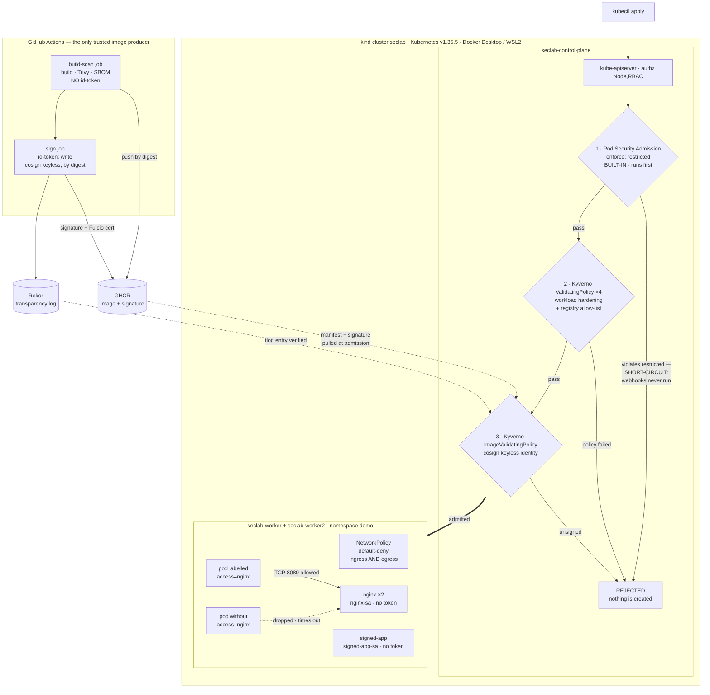

# k8s-security-lab

Hardened Kubernetes cluster + secure software supply chain, built to demonstrate "attack → control blocks it".

Every control in this repo ships with three things: an attack run against the live cluster, the verbatim transcript of that attack being refused, and a runbook that replays both. A control with no captured denial is listed as roadmap, not as a feature — and where a control's scope is narrower than its name suggests, the scope is written down rather than rounded up.

## Goal

Security is the point of this project, not DevOps. Kubernetes and CI are only the substrate; the real deliverable is a set of concrete, defensible security controls. Every layer of the stack gets a documented attack demo with before/after evidence, so the effect of each control is observable rather than assumed. The aim is to prove that a specific attack succeeds when a control is absent and is blocked once the control is in place. Treat this repo as a case study you can read top to bottom.

Read [`docs/threat-model.md`](docs/threat-model.md) first if you only read one file. It reframes the phases as adversary-driven design rather than a tool tour: named adversaries with goals and assumed starting capabilities, the five trust boundaries and what each guard does *not* cover, a MITRE ATT&CK mapping marked full vs partial, and a residual-risk section that states the gaps this lab deliberately leaves open.

## Architecture

A local kind cluster (1 control-plane + 2 workers) running on Docker Desktop with the WSL2 backend, defined entirely as code so the environment is reproducible. Kubernetes is pinned to v1.35.5 (node image pinned by digest) because the Kyverno 1.18 admission layer supports Kubernetes 1.33–1.35 only, so the cluster sits at the top of that supported window. Each security layer is added on top of this baseline cluster and exercised with its own attack demo.

The admission path — the ordered set of gates every workload passes before it exists, and where each attack dies:



Gate-by-gate notes, the sealed-secrets path (the only other artifact that crosses from Git into the cluster), and the full attack → control table are in [`docs/architecture.md`](docs/architecture.md).

## Security layers

### Built and proven

Run against the live cluster, each with a committed transcript. The first five **enforce**: they refuse the attack at admission, at the network layer, or by cryptography. The last two do **not**, and they fail to enforce in two different ways that should not be blurred together. Phase 5 is an assessment: it runs on request, measures configuration once, and gates nothing. Phase 6 is a sensor: it watches continuously and writes an alert *after* the fact, which means the attack it reports on has already happened. Neither borrows the credibility of the five above it, and both say so in every column — the phase-6 row in particular records "this was seen", never "this was stopped". The scope column is there because these controls are namespace-scoped by design, not cluster-wide — see [§6.7 of the threat model](docs/threat-model.md#6-residual-risk-and-what-is-deliberately-out-of-scope).

| Layer | Tool | Attack it blocks | Enforced scope |
| --- | --- | --- | --- |
| RBAC hardening | Kubernetes RBAC | Privilege escalation via over-broad service account permissions | `developer` Role in `demo` (no `secrets`, no write verbs, no wildcards); `nginx-sa` / `signed-app-sa` mount no token at all |
| Admission control | Pod Security Admission + 4 Kyverno `ValidatingPolicy` in Deny | Deploying privileged / non-compliant workloads (privileged, `hostPath /`, capability add-back, `:latest`, unvetted registry) | PSA `enforce: restricted` on `demo`; the four Kyverno policies select `demo` + `demo-kyverno-only`, covering bare Pods, `pods/ephemeralcontainers`, `apps/v1` controllers and `batch/v1` jobs |
| Network policies | Kubernetes NetworkPolicy | Lateral movement between pods | Namespace `demo` — default-deny ingress **and** egress, a CoreDNS carve-out, and one label-gated allow pair on TCP 8080 |
| Secrets management | sealed-secrets | Plaintext secrets committed to Git | The committed ciphertext, bound by strict scope to `demo/demo-app-secret`; the private key never leaves `kube-system` |
| Supply chain | GitHub Actions + Trivy + SBOM + cosign, enforced by a Kyverno `ImageValidatingPolicy` | Running an image this project never built — unsigned or untrusted-provenance images under the lab's own registry path | Images matching `ghcr.io/joesevv/k8s-security-lab/*` in `demo` + `demo-kyverno-only`. Docker Hub `nginxinc/*` and `curlimages/*` are out of glob on purpose: they have no signature to prove, and are constrained by the registry allow-list and digest pins instead |
| CIS benchmark **assessment, not a control** | kube-bench v0.15.6 (digest-pinned), run as two `batch/v1` Jobs with `--benchmark cis-1.12` | **None. This row blocks no attack and gates nothing** — it measures. kube-bench reads control-plane and node configuration and scores it against CIS; what it produced is a list of gaps, not a gate. The findings that were not already conceded elsewhere are written up in [§6.12 of the threat model](docs/threat-model.md#6-residual-risk-and-what-is-deliberately-out-of-scope), and **none of them is remediated** — running a benchmark measures the gap, it does not close it | **Nothing is enforced by this row.** Its *scan* scope: namespace `cis-benchmark`, which carries no PSA enforcement label and sits outside the Kyverno policies' namespace selector — deliberately, because the scan requires `hostPID: true` and `hostPath` mounts of `/etc/kubernetes` and `/var/lib/etcd`, which `demo`'s `restricted` profile correctly refuses (that refusal is the phase's attack demo, below). Coverage was one control-plane Pod and one worker Pod, so **`seclab-worker2` was never scanned** |
| Runtime detection **alerts only, not a control** | Falco 0.44.1 (Helm chart `falco-9.1.0`; both images and both OCI artifacts digest-pinned), a 3-pod DaemonSet in namespace `falco` on the `modern_ebpf` driver, running the stock `falco-rules` ruleset pinned by digest — no custom rules were written | **None. This row blocks no attack and gates nothing** — it observes, and it observes late. Falco reads syscalls through an eBPF probe and prints a line to its own stdout when a rule matches; by then the thing it describes has already run. The demo is exactly that: an interactive shell spawned in the hardened `demo/nginx` pod returned exit 0, and a copy of busybox staged in `/dev/shm` executed with `evt_res=SUCCESS` — `readOnlyRootFilesystem` closed the image and left the one writable, executable path open. Falco emitted `A shell was spawned in a container with an attached terminal` at priority Notice and `File execution detected from /dev/shm` at priority Warning — the message text and the priority are what an alert line actually carries, since `json_output` is off and no line carries a rule name — and then nothing else happened: the pod is still `Running` with `restartCount` unchanged, nothing was killed, evicted or network-fenced. **Detection without response does not mitigate**, so this phase earns no ATT&CK mapping and its residual risk stays open — [§6.4 and §6.13 of the threat model](docs/threat-model.md#6-residual-risk-and-what-is-deliberately-out-of-scope) | **Nothing is enforced by this row.** Its *observation* scope: one pod per node on all three nodes, the `syscall` source only, the stock ruleset only. Three limits, all measured rather than assumed. **The alert's entire lifetime is the falco container's stdout** — `file_output`, `http_output`, `program_output` and `json_output` are all off, `responseActions.enabled=false`, and no falcosidekick, Talon or log store exists anywhere on the cluster, so an alert survives until log rotation or pod restart and reaches no human. **The three nodes are one shared WSL2 kernel**: a single event is reported by all three Falco pods at near-identical microseconds and only the pod co-located with the target resolves `k8s_pod_name`, so this is one kernel observed three times, not a three-node fleet, and any alert count must be divided by three. **False negatives were not enumerated** — the textbook `cat /etc/shadow` probe fires nothing at all here, because as uid 101 the open fails `EACCES` and the stock rule matches successful opens only. And the sensor itself runs `privileged: true` in namespace `falco`, which carries `pod-security.kubernetes.io/enforce: privileged` and sits outside the Kyverno namespace selector — a second unenforced namespace alongside `cis-benchmark` |

Two limits of the supply-chain row worth stating on the front page rather than in a footnote. The CVE gate is **report-only**: Trivy runs with `exit-code: '0'`, so `CRITICAL`/`HIGH` findings are uploaded as SARIF and never fail the build. And a signature attests **provenance, not the absence of vulnerabilities** — a signed image carrying a critical CVE is admitted by design. Both are deliberate, and both are written up with the rest of what this lab does not defend in [§6 of the threat model](docs/threat-model.md#6-residual-risk-and-what-is-deliberately-out-of-scope).

The phase-5 row's numbers need the same care, because "CIS benchmark" reads as a compliance score and this is a scan of a kind cluster. The two Jobs scored **63 PASS / 12 FAIL / 56 WARN**, and not one of those three numbers means what it appears to mean. **63 is "checks kube-bench scored as passing", not "controls verified compliant"** — check 4.2.5 is a demonstrated false PASS, scored `noteq 0` against the *string* `0s` while all three nodes really do set `streamingConnectionIdleTimeout: 0s`, the exact condition that check exists to forbid. **38 of the 56 WARNs were never evaluated at all**: 27 are `type: manual` checks that carry no audit command and print WARN unconditionally, and 11 shell out to `kubectl` from a Pod that deliberately mounts no ServiceAccount token, so their audits return nothing. That leaves **30 checks (12 FAIL + 18 WARN) that actually ran and did not pass**. Reading the rest as failures would state the opposite of reality — 5.2.1, 5.2.3 and 5.2.11 all WARN, while this cluster demonstrably denies exactly what they ask about. And a good CIS score on kind is mostly kubeadm's defaults rather than a hardening decision this lab made ([§6.8](docs/threat-model.md#6-residual-risk-and-what-is-deliberately-out-of-scope)). Full triage in the runbook.

### Roadmap

Not built. No policy, no evidence, nothing enforcing.

| Layer | Tool | Attack it would block |
| --- | --- | --- |
| GitOps CD | ArgoCD | Untracked / manual cluster drift |
| Custom controller (stretch) | Go | Enforcing a bespoke security invariant |

## Attack → control mapping

One entry per demonstrated attack, each pairing the attack with the control that answers it and linking to the captured evidence. The first six rows pair an attack with the control that **blocks** it. The last row does not, and the table would be dishonest if it read as though it did: in phase 6 the attack **succeeds** and is merely reported, which is a different and weaker outcome than every row above it.

| Control | Attack | Evidence |
| --- | --- | --- |
| Phase 2a RBAC — least-privilege `developer` Role (get/list/watch pods/services/deployments only) + no-token `nginx-sa` | Token-bearing pod (`developer-sa`) uses its mounted ServiceAccount token to read Secrets via the API | HTTP 403 Forbidden — [`docs/evidence/phase-2a-rbac/`](docs/evidence/phase-2a-rbac/) (attack-output.txt, can-i-matrix.txt); runbook [`runbooks/phase-2a-rbac.md`](runbooks/phase-2a-rbac.md). Layered defense: the secret-read path is now blocked by **both** RBAC (403) and Phase 2c NetworkPolicy egress default-deny — a replay today times out at the network layer before RBAC's 403, so see [`REPLAY-NOTE.md`](docs/evidence/phase-2a-rbac/REPLAY-NOTE.md) for the replay caveat |
| Phase 2b admission — 4 Kyverno CEL `ValidatingPolicy` rules in Enforce (no privileged, no `:latest`/bare tags, must drop ALL caps and add none back, registry allow-list) scoped to `demo` + `demo-kyverno-only`, plus PSA `enforce: restricted` on `demo` | Nine attack applies: the four single-rule pods, capability add-back, a privileged Deployment and a privileged CronJob (the pod-controller path), an ephemeral-container injection via `kubectl debug`, and a `hostPath /` + `runAsUser: 0` pod | All denied at admission, each rejection naming the policy — or, for `hostPath`/`runAsUser`, naming PodSecurity, since **no Kyverno policy here covers `hostPath`** and PSA is what closes that gap; compliant workloads still admit — [`docs/evidence/phase-2b-admission/`](docs/evidence/phase-2b-admission/) (attack-output.txt, attack-*.yaml); runbook [`runbooks/phase-2b-admission.md`](runbooks/phase-2b-admission.md) |
| Phase 2c network — default-deny ingress+egress NetworkPolicies in `demo` with a CoreDNS carve-out (53/UDP+TCP) and a label-based allow pair (nginx ingress from `access=nginx` pods on TCP 8080, matching client egress) | Unauthorized pod (no `access=nginx` label, otherwise identical to the authorized client) curls `nginx.demo.svc.cluster.local` | Connection blocked by NetworkPolicy — HTTP:000 after a 5s timeout, while the labeled control pod gets HTTP:200 in milliseconds and both pods still resolve DNS — [`docs/evidence/phase-2c-network/`](docs/evidence/phase-2c-network/) (attack-output.txt, attacker-unauthorized.yaml, client-authorized.yaml); runbook [`runbooks/phase-2c-network.md`](runbooks/phase-2c-network.md) |
| Phase 3 secrets — sealed-secrets controller (v0.38.4, kube-system), strict-scoped SealedSecret committed to Git | Repo reader takes the committed SealedSecret and tries to recover the plaintext (base64-decode the ciphertext / reseal into an attacker namespace) | Ciphertext decodes to garbage, offline unseal impossible without the in-cluster private key, scope-theft rejected, in-cluster round-trip confirmed by SHA-256 match, and `git grep` finds no plaintext — [`docs/evidence/phase-3-secrets/`](docs/evidence/phase-3-secrets/) (attack-output.txt, scope-theft-attacker-ns.yaml); runbook [`runbooks/phase-3-secrets.md`](runbooks/phase-3-secrets.md) |
| Phase 4 supply chain — Kyverno `ImageValidatingPolicy` `require-keyless-signed-ghcr` (Deny + `failurePolicy: Fail`) requiring a cosign keyless signature whose Fulcio identity equals one exact workflow subject, checked against the Rekor log; matched on `ghcr.io/joesevv/k8s-security-lab/*` in `demo` + `demo-kyverno-only` | An image that **really exists in the registry and really has no signature** — cosign's own signature artifact, published under the OCI referrers-fallback tag `sha256-<digest>`, which nothing ever signed itself — deployed as a bare Pod and again as a Deployment, both otherwise fully compliant with every other control | Denied at admission with the policy's own verdict (`Policy require-keyless-signed-ghcr failed: Image must be cosign keyless-signed by the k8s-security-lab GitHub Actions workflow`), on the Pod path and the `apps/v1` path; the genuinely signed digest still admits as the positive control, and the out-of-glob nginx workload is unaffected — [`docs/evidence/phase-4-supply-chain/`](docs/evidence/phase-4-supply-chain/) (attack-output.txt, attack-unsigned-existing-artifact.yaml, attack-unsigned-image.yaml); runbook [`runbooks/phase-4-supply-chain.md`](runbooks/phase-4-supply-chain.md). A second case using a tag CI never built is kept separate on purpose: a registry 404 proves only that the gate fails closed, not that signatures are checked |
| Phase 5 CIS assessment — no new control; this row re-tests PSA `enforce: restricted` on `demo` and the Kyverno `ValidatingPolicy` set from the opposite direction, with the lab's **own security scanner** as the object being refused | kube-bench genuinely requires `hostPID: true` and `hostPath` mounts of `/etc/kubernetes`, `/var/lib/etcd` and `/var/lib/kubelet` to read what CIS asks about. That spec is applied to `demo` twice — once as a bare Pod, once as the `batch/v1` Job it really ships as — to see whether a *legitimate* privileged workload is treated any differently from an attacker's | Refused both times, **by two different controls at two different stages, and the difference is the point**. Pod path: `Error from server (Forbidden): ... violates PodSecurity "restricted:v1.35": host namespaces (hostPID=true), restricted volume types ..., runAsNonRoot != true, runAsUser=0` — four independent violations, PodSecurity naming the *pinned* `v1.35` enforce version. Job path: PodSecurity only **warns** (`restricted:latest`) and would have admitted, because PSA enforces against Pods, not against `batch/v1` controllers; the denial instead comes from Kyverno `restrict-registries` — **for the registry, not for `hostPID` or `hostPath`**, since no `ValidatingPolicy` here covers either. Claiming "Kyverno blocks kube-bench because it is privileged" would exceed enforced reality. The scan therefore ran in `cis-benchmark`, outside both layers, which is [§6.7](docs/threat-model.md#6-residual-risk-and-what-is-deliberately-out-of-scope)'s conceded residual risk made explicit rather than hidden in `default` — [`docs/evidence/phase-5-cis/`](docs/evidence/phase-5-cis/) (attack-output.txt, rejected-in-demo-pod.yaml, rejected-in-demo-job.yaml, job-kube-bench-master.yaml, job-kube-bench-node.yaml); runbook [`runbooks/phase-5-cis-benchmark.md`](runbooks/phase-5-cis-benchmark.md). What this does **not** show: that kube-bench is malicious, or that the refusal is desirable — a real remediation would need a scanner-shaped exception, and this lab did not build one |
| Phase 6 runtime detection — **no new control, and the only row here whose attack is not blocked**. Falco 0.44.1 runs as a DaemonSet in its own `falco` namespace and reports on behaviour that PSA, Kyverno and NetworkPolicy already admitted. Two demonstrations sit in this row: what the sensor sees, and what this cluster does when the sensor itself asks to run in `demo` | An interactive shell — a real PTY, obtained with `script` on the node, not a synthesized event — spawned inside `demo/nginx-775678cbbd-q7ddt`, which is the hardened workload: uid 101, capabilities dropped, read-only rootfs, digest-pinned signed base image. Then a copy of busybox staged into `/dev/shm` and executed, `/dev/shm` being the one writable and executable path `readOnlyRootFilesystem` leaves open | **Both attacks succeeded. Neither was blocked, and that is the finding.** The shell returned exit 0 and printed its marker; the staged binary ran with `evt_res=SUCCESS proc_exepath=/dev/shm/bb`. Falco's entire response was alert lines on a pod's stdout — three of them in the attack window, since an earlier, unrecorded shell-spawn rehearsal at `15:12:42.954798594` sits in the same log ahead of the two demonstrations. The two that answer the attacks above, each timestamped inside the window: `15:13:32.047577782: Notice A shell was spawned in a container with an attached terminal \| ... user_uid=101 process=sh proc_exepath=/bin/busybox ... terminal=34816 container_name=nginx k8s_pod_name=nginx-775678cbbd-q7ddt k8s_ns_name=demo` and `15:14:27.005294126: Warning File execution detected from /dev/shm \| evt_res=SUCCESS ... proc_exepath=/dev/shm/bb`. Afterwards the target pod is still `Running` on the same node with `restartCount` unchanged at 2 (last restart 26h earlier) and `/dev/shm/bb` still present and executable — nothing killed, evicted or fenced it. The second demonstration is the placement constraint, and it splits by object form exactly as phase 5's did: the Falco Pod spec applied to `demo` is refused by PodSecurity — `Error from server (Forbidden): pods "falco-psa-isolated" is forbidden: violates PodSecurity "restricted:v1.35": privileged ..., restricted volume types ..., runAsNonRoot != true ...` — while the DaemonSet form draws only a PSA **warning** naming `restricted:latest` and is denied by Kyverno instead (`admission webhook "vpol.validate.kyverno.svc-fail" denied the request: Policy require-drop-all-capabilities failed ...; Policy restrict-registries failed ...; Policy disallow-privileged-containers failed ...`). A first Pod probe is kept in the evidence precisely because it answered the wrong question: it was refused by the **ServiceAccount admission plugin** (`error looking up service account demo/falco: serviceaccount "falco" not found`) in the mutating phase, before PSA ever evaluated it, so reading "PSA refuses Falco" off that output would have been false — [`docs/evidence/phase-6-falco/`](docs/evidence/phase-6-falco/) (attack-output.txt, 00-namespace-falco.yaml, falco-daemonset-rendered.yaml, rejected-in-demo-daemonset.yaml, rejected-in-demo-pod.yaml, rejected-in-demo-pod-sa-isolated.yaml); install record [`clusters/falco-install.md`](clusters/falco-install.md); runbook [`runbooks/phase-6-falco.md`](runbooks/phase-6-falco.md). What this does **not** show: that either attack was prevented; that anyone would have found out, since the alert went to a container's stdout with no routing, no persistence and no on-call; or that comparable behaviour is caught in general — the textbook `cat /etc/shadow` probe against this same pod produced **no alert at all**, because the open failed with `EACCES` and the stock rule matches successful opens only |

## Repo layout

The tree as it stands today, abridged to what a reader needs:

```
app/signed-app/           # the image this lab builds and signs (Dockerfile + static page)
clusters/                 # kind cluster config; Kyverno and sealed-secrets install notes
workloads/                # workload manifests (nginx, signed-app)
policies/                 # Kyverno ValidatingPolicies (phase 2b) + the warn-only demo namespace
policies/supply-chain/    # Kyverno ImageValidatingPolicy — the cosign signature gate (phase 4)
rbac/                     # RBAC roles and bindings
network/                  # network policies
secrets/                  # sealed-secrets manifests (ciphertext only; plaintext is gitignored)
.github/workflows/        # supply-chain CI (Trivy, SBOM, cosign keyless signing)
docs/threat-model.md      # adversaries, trust boundaries, ATT&CK mapping, residual risk
docs/architecture.md      # admission-path and sealed-secrets diagrams
docs/evidence/            # captured attack transcripts, one directory per phase
runbooks/                 # replayable command logs, one per phase
```

## Status

Cluster up — 3 nodes on Kubernetes v1.35.5, with two hardened workloads in `demo`: nginx (Docker Hub, digest-pinned, non-root, no service-account token) and `signed-app`, this repo's own image, pinned to the digest cosign signed — re-applying its manifest through the full admission chain passes, while the same Deployment with an unsigned image reference is denied. Five layers are live and enforcing — phase 2a RBAC, phase 2b admission (PSA `restricted` + four Kyverno `ValidatingPolicy` in Deny), phase 2c NetworkPolicy default-deny, phase 3 sealed-secrets, and phase 4 cosign keyless signature verification — each with a committed attack transcript in [`docs/evidence/`](docs/evidence/) and a replayable runbook in [`runbooks/`](runbooks/). A [threat model](docs/threat-model.md) and [architecture diagrams](docs/architecture.md) now cover the whole set.

The restructured two-job CI workflow has now run. Run `30174855073` (2026-07-25) was the first execution of the `build-scan` / `sign` split, and both jobs passed on that first execution — including the `sign` job's own `cosign verify` self-check, which validated the signature it had just produced against the same certificate identity and OIDC issuer the Kyverno `ImageValidatingPolicy` pins, byte for byte. That run produced signed image tag `b8483c5892a16afb16c1a15aaaa35b3c8436dd65` @ `sha256:7fd13d22d934f4202edc164e525436e190498590b62c41e348b1a4092eb3337b`; the workload manifest is repinned to that digest, the cluster is running it, and the verify transcript is captured in [`docs/evidence/phase-4-supply-chain/cosign-verify.txt`](docs/evidence/phase-4-supply-chain/cosign-verify.txt). As of 2026-07-25 that split has run five times — `30174855073`, `30179122521`, `30179345902`, `30179460564`, `30179497251` — with `build-scan` and `sign` both green in every one. Three of those five closed the Dependabot pin-plus-track loop end to end: PRs #1–#3 each bumped a SHA-pinned action (`docker/login-action` 3.7.0→4.5.1, `actions/upload-artifact` 4.6.2→7.0.1, `actions/checkout` 4.4.0→7.0.1), rewriting **both** halves of the pin — the 40-char SHA and its trailing `# vX.Y.Z` comment, so the pin stays readable to a reviewer — and because the workflow file is one of its own trigger paths, each merge rebuilt, re-scanned, re-signed and re-verified green. The bumps also cleared what motivated them: the runs before those merges carried a Node.js 20 deprecation warning naming exactly those three actions, the warning shrank by one action per merge, and as of 2026-07-25 the annotations API returns zero annotations for both jobs of `30179497251`. Two limits still worth stating rather than burying: five runs inside a single day, over application source unchanged since the pipeline was written, is repeatable evidence that the shape works and not yet a track record; and the build is not byte-reproducible — an unchanged `app/signed-app` source tree rebuilds to a different digest every time (`sha256:b4cb133e…` from the earlier single-job run, then a distinct digest on each of the five runs since), so a digest here identifies one particular build rather than the source alone. The workload stays pinned to `sha256:7fd13d22…` on purpose rather than chasing the newest build: that is the digest the committed `cosign verify` transcript covers, and you pin what you verified.

Phase 5 landed 2026-07-26 and is deliberately **not** a sixth enforcing layer. kube-bench v0.15.6, pinned to `--benchmark cis-1.12`, ran as two Jobs in a dedicated `cis-benchmark` namespace and scored the cluster 63 PASS / 12 FAIL / 56 WARN — numbers qualified above and in the runbook, because 38 of those WARNs were never evaluated and at least one PASS is provably false. It changed no manifest, closed no finding and enforces nothing: its output is a measurement, and the real findings it surfaced are recorded as residual risk in [§6.12 of the threat model](docs/threat-model.md#6-residual-risk-and-what-is-deliberately-out-of-scope) rather than presented as fixed. Its one genuine attack → control demonstration is that this cluster's own controls refuse the scanner — and **which** control answers depends on which object you submit. As a bare Pod, PSA `enforce: restricted` denies it outright on four counts (`hostPID=true`, restricted volume types, `runAsNonRoot != true`, `runAsUser=0`). As the `batch/v1` Job kube-bench really ships as, PSA only **warns** and would have admitted it — PSA enforces against Pods, not against `batch/v1` controllers — and the denial comes instead from Kyverno `restrict-registries`, **for the registry, not for `hostPID` or `hostPath`**, since no `ValidatingPolicy` here covers either — evidence in [`docs/evidence/phase-5-cis/`](docs/evidence/phase-5-cis/), runbook [`runbooks/phase-5-cis-benchmark.md`](runbooks/phase-5-cis-benchmark.md). Coverage gap worth naming: the node Job produced one Pod, so `seclab-worker2` was never scanned.

Phase 6 landed 2026-07-29 and is the second non-enforcing phase, but it does not fail to enforce in the way phase 5 did. Falco 0.44.1 (Helm chart `falco-9.1.0`, both container images and both OCI artifacts — ruleset and container-metadata plugin — pinned by digest) runs as a three-pod DaemonSet in its own `falco` namespace on the `modern_ebpf` driver. The driver was confirmed against ground truth rather than taken from the flag: no Falco kernel module is loaded on any node, and PID 1 inside the sensor holds 197 live `bpf-prog` file descriptors. **It detects. It does not prevent.** The demo is an interactive shell and a `/dev/shm` payload execution inside the hardened `demo/nginx` pod — both succeeded, both produced an alert inside the attack window (`A shell was spawned in a container with an attached terminal`, priority Notice; `File execution detected from /dev/shm`, priority Warning — message text and priority are what the line carries, because `json_output` is off and the rule names are an identification against the stock ruleset rather than a captured field), and neither was stopped: the pod is still `Running` with `restartCount` unchanged. Those alerts go to the falco container's stdout and nowhere else. `file_output`, `http_output`, `program_output` and `json_output` are all off, `responseActions.enabled=false`, and no falcosidekick, Talon or log store exists on the cluster, so an alert's lifetime ends at log rotation or pod restart and it reaches no human. That is why [§6.4 of the threat model](docs/threat-model.md#6-residual-risk-and-what-is-deliberately-out-of-scope) was rewritten rather than closed and a new [§6.13](docs/threat-model.md#6-residual-risk-and-what-is-deliberately-out-of-scope) was added: detection without response does not mitigate, so phase 6 takes no row in the ATT&CK mapping table and makes no "attack it blocks" claim anywhere. Two coverage limits belong on the front page rather than in a footnote: the three kind nodes share one WSL2 kernel, so every event is reported three times and only the co-located pod resolves the pod name — one kernel observed three times, not a three-node fleet — and false negatives were never enumerated, with the classic `cat /etc/shadow` demo firing nothing at all against this lab's non-root workload. Evidence in [`docs/evidence/phase-6-falco/`](docs/evidence/phase-6-falco/), install record [`clusters/falco-install.md`](clusters/falco-install.md), runbook [`runbooks/phase-6-falco.md`](runbooks/phase-6-falco.md). Landing Falco before ArgoCD reverses the order the roadmap and the previous status line stated on 2026-07-26; the swap was deliberate and is recorded here rather than made silently. Next up: GitOps CD with ArgoCD — 2026-07-29.

## License

Apache-2.0 — see [`LICENSE`](LICENSE).
