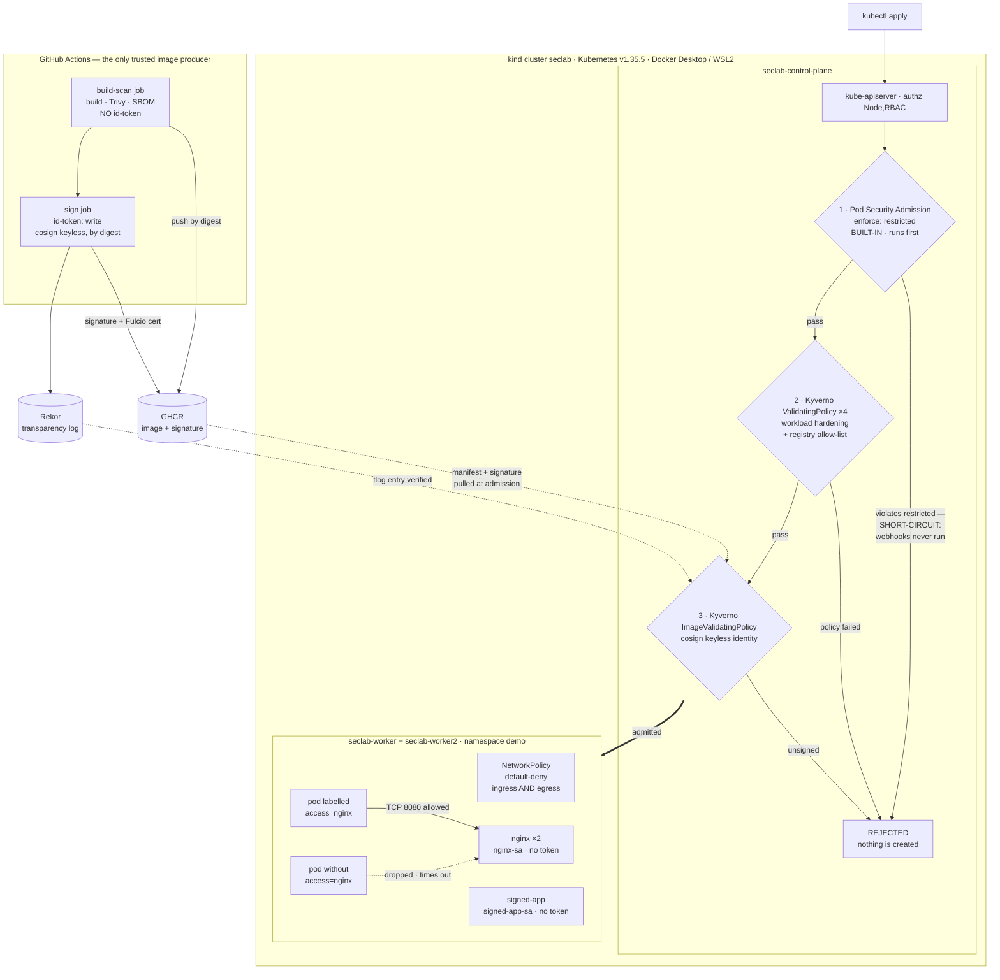

# k8s-security-lab

Hardened Kubernetes cluster + secure software supply chain, built to demonstrate "attack → control blocks it".

Every control in this repo ships with three things: an attack run against the live cluster, the verbatim transcript of that attack being refused, and a runbook that replays both. A control with no captured denial is listed as roadmap, not as a feature — and where a control's scope is narrower than its name suggests, the scope is written down rather than rounded up.

## Goal

Security is the point of this project, not DevOps. Kubernetes and CI are only the substrate; the real deliverable is a set of concrete, defensible security controls. Every layer of the stack gets a documented attack demo with before/after evidence, so the effect of each control is observable rather than assumed. The aim is to prove that a specific attack succeeds when a control is absent and is blocked once the control is in place. Treat this repo as a case study you can read top to bottom.

Read [`docs/threat-model.md`](docs/threat-model.md) first if you only read one file. It reframes the phases as adversary-driven design rather than a tool tour: named adversaries with goals and assumed starting capabilities, the five trust boundaries and what each guard does *not* cover, a MITRE ATT&CK mapping marked full vs partial, and a residual-risk section that states the gaps this lab deliberately leaves open.

## Architecture

A local kind cluster (1 control-plane + 2 workers) running on Docker Desktop with the WSL2 backend, defined entirely as code so the environment is reproducible. Kubernetes is pinned to v1.35.5 (node image pinned by digest) because the Kyverno 1.18 admission layer supports Kubernetes 1.33–1.35 only, so the cluster sits at the top of that supported window. Each security layer is added on top of this baseline cluster and exercised with its own attack demo.

The admission path — the ordered set of gates every workload passes before it exists, and where each attack dies:



Gate-by-gate notes, the sealed-secrets path (the only other artifact that crosses from Git into the cluster), and the full attack → control table are in [`docs/architecture.md`](docs/architecture.md).

## Security layers

### Built and proven

Enforcing on the live cluster right now, each with a committed attack transcript. The scope column is there because these controls are namespace-scoped by design, not cluster-wide — see [§6.7 of the threat model](docs/threat-model.md#6-residual-risk-and-what-is-deliberately-out-of-scope).

| Layer | Tool | Attack it blocks | Enforced scope |
| --- | --- | --- | --- |
| RBAC hardening | Kubernetes RBAC | Privilege escalation via over-broad service account permissions | `developer` Role in `demo` (no `secrets`, no write verbs, no wildcards); `nginx-sa` / `signed-app-sa` mount no token at all |
| Admission control | Pod Security Admission + 4 Kyverno `ValidatingPolicy` in Deny | Deploying privileged / non-compliant workloads (privileged, `hostPath /`, capability add-back, `:latest`, unvetted registry) | PSA `enforce: restricted` on `demo`; the four Kyverno policies select `demo` + `demo-kyverno-only`, covering bare Pods, `pods/ephemeralcontainers`, `apps/v1` controllers and `batch/v1` jobs |
| Network policies | Kubernetes NetworkPolicy | Lateral movement between pods | Namespace `demo` — default-deny ingress **and** egress, a CoreDNS carve-out, and one label-gated allow pair on TCP 8080 |
| Secrets management | sealed-secrets | Plaintext secrets committed to Git | The committed ciphertext, bound by strict scope to `demo/demo-app-secret`; the private key never leaves `kube-system` |
| Supply chain | GitHub Actions + Trivy + SBOM + cosign, enforced by a Kyverno `ImageValidatingPolicy` | Running an image this project never built — unsigned or untrusted-provenance images under the lab's own registry path | Images matching `ghcr.io/joesevv/k8s-security-lab/*` in `demo` + `demo-kyverno-only`. Docker Hub `nginxinc/*` and `curlimages/*` are out of glob on purpose: they have no signature to prove, and are constrained by the registry allow-list and digest pins instead |

Two limits of the supply-chain row worth stating on the front page rather than in a footnote. The CVE gate is **report-only**: Trivy runs with `exit-code: '0'`, so `CRITICAL`/`HIGH` findings are uploaded as SARIF and never fail the build. And a signature attests **provenance, not the absence of vulnerabilities** — a signed image carrying a critical CVE is admitted by design. Both are deliberate, and both are written up with the rest of what this lab does not defend in [§6 of the threat model](docs/threat-model.md#6-residual-risk-and-what-is-deliberately-out-of-scope).

### Roadmap

Not built. No policy, no evidence, nothing enforcing.

| Layer | Tool | Attack it would block |
| --- | --- | --- |
| GitOps CD | ArgoCD | Untracked / manual cluster drift |
| Runtime detection | Falco | Malicious runtime behavior (shell in container, etc.) |
| CIS compliance | kube-bench | Insecure cluster configuration |
| Custom controller (stretch) | Go | Enforcing a bespoke security invariant |

## Attack → control mapping

One entry per demonstrated attack, each pairing the attack with the control that blocks it and linking to the captured evidence.

| Control | Attack | Evidence |
| --- | --- | --- |
| Phase 2a RBAC — least-privilege `developer` Role (get/list/watch pods/services/deployments only) + no-token `nginx-sa` | Token-bearing pod (`developer-sa`) uses its mounted ServiceAccount token to read Secrets via the API | HTTP 403 Forbidden — [`docs/evidence/phase-2a-rbac/`](docs/evidence/phase-2a-rbac/) (attack-output.txt, can-i-matrix.txt); runbook [`runbooks/phase-2a-rbac.md`](runbooks/phase-2a-rbac.md). Layered defense: the secret-read path is now blocked by **both** RBAC (403) and Phase 2c NetworkPolicy egress default-deny — a replay today times out at the network layer before RBAC's 403, so see [`REPLAY-NOTE.md`](docs/evidence/phase-2a-rbac/REPLAY-NOTE.md) for the replay caveat |
| Phase 2b admission — 4 Kyverno CEL `ValidatingPolicy` rules in Enforce (no privileged, no `:latest`/bare tags, must drop ALL caps and add none back, registry allow-list) scoped to `demo` + `demo-kyverno-only`, plus PSA `enforce: restricted` on `demo` | Nine attack applies: the four single-rule pods, capability add-back, a privileged Deployment and a privileged CronJob (the pod-controller path), an ephemeral-container injection via `kubectl debug`, and a `hostPath /` + `runAsUser: 0` pod | All denied at admission, each rejection naming the policy — or, for `hostPath`/`runAsUser`, naming PodSecurity, since **no Kyverno policy here covers `hostPath`** and PSA is what closes that gap; compliant workloads still admit — [`docs/evidence/phase-2b-admission/`](docs/evidence/phase-2b-admission/) (attack-output.txt, attack-*.yaml); runbook [`runbooks/phase-2b-admission.md`](runbooks/phase-2b-admission.md) |
| Phase 2c network — default-deny ingress+egress NetworkPolicies in `demo` with a CoreDNS carve-out (53/UDP+TCP) and a label-based allow pair (nginx ingress from `access=nginx` pods on TCP 8080, matching client egress) | Unauthorized pod (no `access=nginx` label, otherwise identical to the authorized client) curls `nginx.demo.svc.cluster.local` | Connection blocked by NetworkPolicy — HTTP:000 after a 5s timeout, while the labeled control pod gets HTTP:200 in milliseconds and both pods still resolve DNS — [`docs/evidence/phase-2c-network/`](docs/evidence/phase-2c-network/) (attack-output.txt, attacker-unauthorized.yaml, client-authorized.yaml); runbook [`runbooks/phase-2c-network.md`](runbooks/phase-2c-network.md) |
| Phase 3 secrets — sealed-secrets controller (v0.38.4, kube-system), strict-scoped SealedSecret committed to Git | Repo reader takes the committed SealedSecret and tries to recover the plaintext (base64-decode the ciphertext / reseal into an attacker namespace) | Ciphertext decodes to garbage, offline unseal impossible without the in-cluster private key, scope-theft rejected, in-cluster round-trip confirmed by SHA-256 match, and `git grep` finds no plaintext — [`docs/evidence/phase-3-secrets/`](docs/evidence/phase-3-secrets/) (attack-output.txt, scope-theft-attacker-ns.yaml); runbook [`runbooks/phase-3-secrets.md`](runbooks/phase-3-secrets.md) |
| Phase 4 supply chain — Kyverno `ImageValidatingPolicy` `require-keyless-signed-ghcr` (Deny + `failurePolicy: Fail`) requiring a cosign keyless signature whose Fulcio identity equals one exact workflow subject, checked against the Rekor log; matched on `ghcr.io/joesevv/k8s-security-lab/*` in `demo` + `demo-kyverno-only` | An image that **really exists in the registry and really has no signature** — cosign's own signature artifact, published under the OCI referrers-fallback tag `sha256-<digest>`, which nothing ever signed itself — deployed as a bare Pod and again as a Deployment, both otherwise fully compliant with every other control | Denied at admission with the policy's own verdict (`Policy require-keyless-signed-ghcr failed: Image must be cosign keyless-signed by the k8s-security-lab GitHub Actions workflow`), on the Pod path and the `apps/v1` path; the genuinely signed digest still admits as the positive control, and the out-of-glob nginx workload is unaffected — [`docs/evidence/phase-4-supply-chain/`](docs/evidence/phase-4-supply-chain/) (attack-output.txt, attack-unsigned-existing-artifact.yaml, attack-unsigned-image.yaml); runbook [`runbooks/phase-4-supply-chain.md`](runbooks/phase-4-supply-chain.md). A second case using a tag CI never built is kept separate on purpose: a registry 404 proves only that the gate fails closed, not that signatures are checked |

## Repo layout

The tree as it stands today, abridged to what a reader needs:

```
app/signed-app/           # the image this lab builds and signs (Dockerfile + static page)
clusters/                 # kind cluster config; Kyverno and sealed-secrets install notes
workloads/                # workload manifests (nginx, signed-app)
policies/                 # Kyverno ValidatingPolicies (phase 2b) + the warn-only demo namespace
policies/supply-chain/    # Kyverno ImageValidatingPolicy — the cosign signature gate (phase 4)
rbac/                     # RBAC roles and bindings
network/                  # network policies
secrets/                  # sealed-secrets manifests (ciphertext only; plaintext is gitignored)
.github/workflows/        # supply-chain CI (Trivy, SBOM, cosign keyless signing)
docs/threat-model.md      # adversaries, trust boundaries, ATT&CK mapping, residual risk
docs/architecture.md      # admission-path and sealed-secrets diagrams
docs/evidence/            # captured attack transcripts, one directory per phase
runbooks/                 # replayable command logs, one per phase
```

## Status

Cluster up — 3 nodes on Kubernetes v1.35.5, with two hardened workloads in `demo`: nginx (Docker Hub, digest-pinned, non-root, no service-account token) and `signed-app`, this repo's own image, pinned to the digest cosign signed — re-applying its manifest through the full admission chain passes, while the same Deployment with an unsigned image reference is denied. Five layers are live and enforcing — phase 2a RBAC, phase 2b admission (PSA `restricted` + four Kyverno `ValidatingPolicy` in Deny), phase 2c NetworkPolicy default-deny, phase 3 sealed-secrets, and phase 4 cosign keyless signature verification — each with a committed attack transcript in [`docs/evidence/`](docs/evidence/) and a replayable runbook in [`runbooks/`](runbooks/). A [threat model](docs/threat-model.md) and [architecture diagrams](docs/architecture.md) now cover the whole set.

The restructured two-job CI workflow has now run. Run `30174855073` (2026-07-25) was the first execution of the `build-scan` / `sign` split, and both jobs passed on that first execution — including the `sign` job's own `cosign verify` self-check, which validated the signature it had just produced against the same certificate identity and OIDC issuer the Kyverno `ImageValidatingPolicy` pins, byte for byte. That run produced signed image tag `b8483c5892a16afb16c1a15aaaa35b3c8436dd65` @ `sha256:7fd13d22d934f4202edc164e525436e190498590b62c41e348b1a4092eb3337b`; the workload manifest is repinned to that digest, the cluster is running it, and the verify transcript is captured in [`docs/evidence/phase-4-supply-chain/cosign-verify.txt`](docs/evidence/phase-4-supply-chain/cosign-verify.txt). Two limits of that green run, stated rather than buried: it is one execution of this workflow shape, not a track record; and the build is not byte-reproducible — an unchanged `app/signed-app` source tree rebuilt to a different digest than the earlier single-job run had produced (`sha256:b4cb133e…`), so a digest here identifies one particular build rather than the source alone. Next up: GitOps CD with ArgoCD — 2026-07-25.

## License

Apache-2.0 — see [`LICENSE`](LICENSE).
