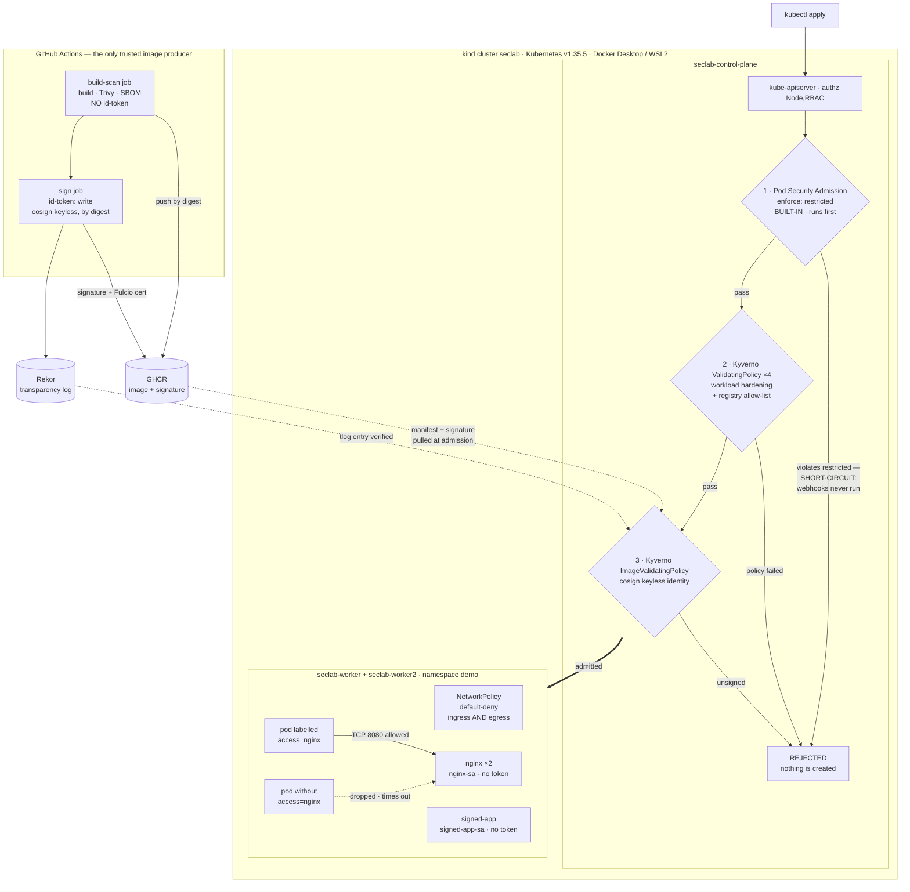
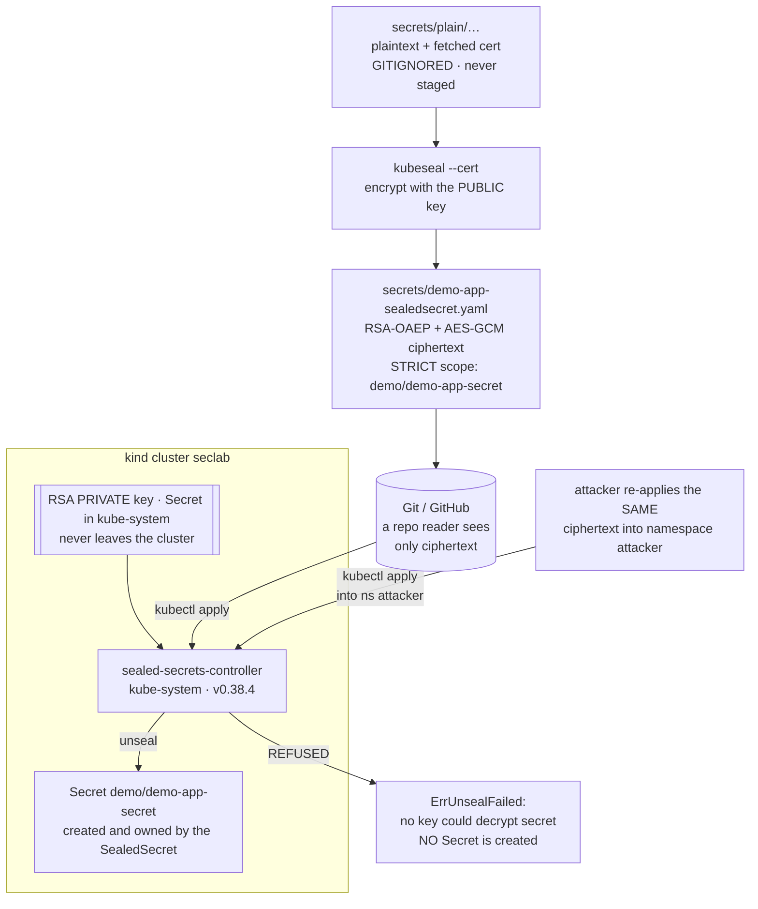

# Architecture

One page, two diagrams. The first is the **admission path** — the ordered set of
gates every workload must pass before it exists, and where each attack dies. The
second is the **sealed-secrets path** — the only other artifact that crosses
from Git into the cluster.

They are kept separate on purpose: the admission diagram is a request flowing
through decision points, the secrets diagram is an artifact being transformed.
Merging them would put two different kinds of edge in one graph and cost more in
legibility than it saves in page count.

Threat model, assets and residual risk: [`threat-model.md`](threat-model.md).

---

## 1. The admission path

Read it top to bottom: an image is produced by exactly one trusted pipeline, and
a `kubectl apply` runs a gauntlet of three gates before anything is scheduled.
**Gate 1 is in-process and runs before any webhook** — when Pod Security
Admission rejects a pod it short-circuits and Kyverno is never called. That
ordering is load-bearing, not cosmetic; it is why a second `warn`-only namespace
exists so the Kyverno denials stay observable.

**Gate 1 — Pod Security Admission**, `enforce: restricted` pinned to `v1.35` on
namespace `demo`. In-process API-server plugin. Covers privileged containers,
`hostPath`, host namespaces, `runAsUser: 0` and un-dropped capabilities.

**Gate 2 — four Kyverno `ValidatingPolicy` resources** in `Deny`
(`disallow-privileged-containers`, `disallow-latest-and-bare-tag`,
`require-drop-all-capabilities`, `restrict-registries`). These cover what
`restricted` has no opinion on — mutable tags and untrusted registries — and
overlap it deliberately elsewhere. Coverage of pod controllers and
`pods/ephemeralcontainers` comes from explicit `resourceRules`, because
`spec.autogen.podControllers` is a no-op on Kyverno 1.18.2.

**Gate 3 — one Kyverno `ImageValidatingPolicy`**, matching only
`ghcr.io/joesevv/k8s-security-lab/*`. Requires a cosign keyless signature whose
Fulcio certificate identity equals one exact subject string, checked against the
Rekor transparency log.

**After admission — NetworkPolicy.** Everything in `demo` is default-deny on
both ingress and egress, with a CoreDNS carve-out and a single label-gated
allow pair on TCP 8080.

---

## 2. The sealed-secrets path

The other thing that crosses from Git into the cluster. The committed artifact
is ciphertext; the key that reverses it is a Secret in `kube-system` that never
leaves the cluster; and the ciphertext is bound to one `namespace/name`, so the
same bytes applied anywhere else are refused.

---

## 3. Attack → control

Each row is a demonstrated attack, the control that stopped it, and the captured
transcript.

| # | Attack | Control that stops it | Where it dies | Evidence |
| --- | --- | --- | --- | --- |
| 1 | Token-bearing pod uses its ServiceAccount token to list `Secrets` via the API | Least-privilege `developer` Role; `automountServiceAccountToken: false` on the workload SAs; NetworkPolicy egress default-deny | API-server authorization — `HTTP 403` (and today, the network layer first) | [`evidence/phase-2a-rbac/`](evidence/phase-2a-rbac/) |
| 2 | Pods that are privileged, `hostPath`-mount `/`, add back capabilities, use `:latest`, or pull from an unvetted registry | Pod Security Admission `restricted` + 4 Kyverno `ValidatingPolicy` in `Deny` | Admission, before the object is persisted | [`evidence/phase-2b-admission/`](evidence/phase-2b-admission/) |
| 3 | Unlabelled pod curls `nginx.demo.svc.cluster.local` to move laterally | NetworkPolicy default-deny + label-gated allow pair | The CNI — `HTTP:000` after a 5s timeout vs `HTTP:200` in ~2 ms for the labelled control | [`evidence/phase-2c-network/`](evidence/phase-2c-network/) |
| 4 | Repo reader decodes the committed SealedSecret, or re-applies it into a namespace they own | Asymmetric sealing (public cert encrypts, in-cluster private key decrypts) + STRICT `namespace/name` scope | Cryptography — ciphertext decodes to garbage; the scope-theft apply gets `ErrUnsealFailed` | [`evidence/phase-3-secrets/`](evidence/phase-3-secrets/) |
| 5 | A real, pullable, **unsigned** image under the enforced GHCR path is deployed | Kyverno `ImageValidatingPolicy` — cosign keyless identity pinned to one exact workflow subject, verified against Rekor | Admission — `Policy require-keyless-signed-ghcr failed` | [`evidence/phase-4-supply-chain/`](evidence/phase-4-supply-chain/) |

Runbooks with the full command logs, all in [`../runbooks/`](../runbooks/):
[`phase-1-cluster.md`](../runbooks/phase-1-cluster.md),
[`phase-2a-rbac.md`](../runbooks/phase-2a-rbac.md),
[`phase-2b-admission.md`](../runbooks/phase-2b-admission.md),
[`phase-2c-network.md`](../runbooks/phase-2c-network.md),
[`phase-3-secrets.md`](../runbooks/phase-3-secrets.md),
[`phase-4-supply-chain.md`](../runbooks/phase-4-supply-chain.md),
[`phase-5-cis-benchmark.md`](../runbooks/phase-5-cis-benchmark.md),
[`phase-5b-cis-remediation.md`](../runbooks/phase-5b-cis-remediation.md),
[`phase-6-falco.md`](../runbooks/phase-6-falco.md).

What is **not** in these diagrams — no encryption at rest, no audit log, no
CVE gate, and policies that stop at the `demo` namespace boundary — is
enumerated with reasons in
[§6 of the threat model](threat-model.md#6-residual-risk-and-what-is-deliberately-out-of-scope).

**The runtime sensor is the one omission that is not a gap: it exists.** Since
2026-07-29 Falco 0.44.1 has run as a three-pod DaemonSet in namespace `falco`,
reading syscalls on all three nodes through a modern eBPF probe. It is left out
of both diagrams on purpose, because neither is a runtime view — the first is
a request passing through ordered gates, the second an artifact being
transformed — and Falco is neither. It sits beside every workload *after*
admission and only watches, so a box for it in a diagram whose whole grammar
is "gate → REJECTED" would read as a gate, and it is not one: it **detects
and does not prevent**. The interactive shell it reported inside `demo/nginx`
on 2026-07-29 ran to completion, and the alert went to a container's stdout
and nowhere else. What the sensor saw, what it missed, and what nothing does
about either are in
[§6.4 and §6.13 of the threat model](threat-model.md#6-residual-risk-and-what-is-deliberately-out-of-scope),
with the transcript in [`evidence/phase-6-falco/`](evidence/phase-6-falco/) and
the replay in [`../runbooks/phase-6-falco.md`](../runbooks/phase-6-falco.md).
